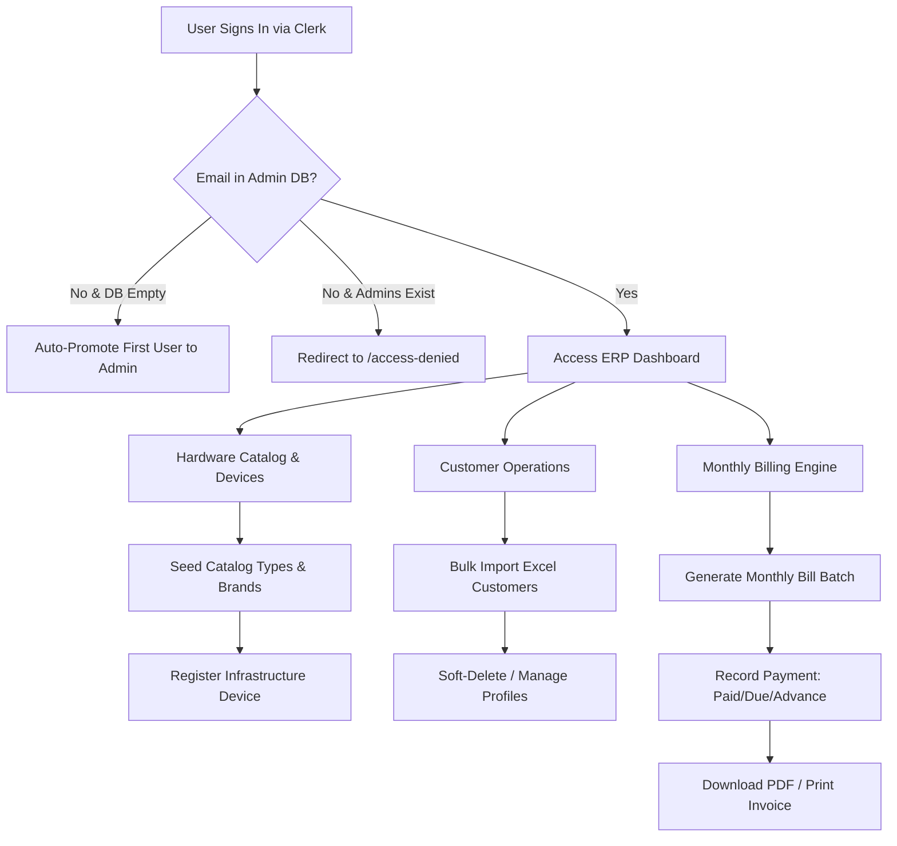

<div align="center">

# 🌐 GESN ISP & Device Management ERP

**An Enterprise-Grade, Modern ISP Business Operations & Network Infrastructure Management Platform**

[](https://nextjs.org/)
[](https://react.dev/)
[](https://www.typescriptlang.org/)
[](https://www.mongodb.com/)
[](https://clerk.com/)
[](https://tailwindcss.com/)
[](LICENSE)

*Streamlining ISP Infrastructure Assets, Hardware Catalogs, Dynamic Billing Engines, Customer Records, Operational Expenses, and Real-Time Financial Analytics.*

[Explore Features](#-key-features) • [Quick Start](#-quick-start--installation) • [Tech Stack](#️-tech-stack) • [Database Schemas](#️-database-schemas) • [Technical Docs](docs/APP_DOCUMENTATION.md)

</div>

---

## 📌 Table of Contents

- [✨ Key Features](#-key-features)
  - [📡 Network Infrastructure & Hardware Catalog](#-network-infrastructure--hardware-catalog)
  - [👥 Customer Database & Bulk Operations](#-customer-database--bulk-operations)
  - [💳 Automated Billing & Invoice Engine](#-automated-billing--invoice-engine)
  - [📊 Financial Analytics & Expense Tracking](#-financial-analytics--expense-tracking)
  - [🔐 RBAC & Access Control](#-rbac--access-control)
  - [⚙️ System Settings & Company Branding](#️-system-settings--company-branding)
- [🛠️ Tech Stack](#️-tech-stack)
- [📁 Project Architecture](#-project-architecture)
- [🗄️ Database Schemas](#️-database-schemas)
- [🌐 Routes & Page Matrix](#-routes--page-matrix)
- [⚡ Quick Start & Installation](#-quick-start--installation)
  - [Prerequisites](#prerequisites)
  - [Installation Steps](#installation-steps)
  - [Environment Variables Schema](#environment-variables-schema)
- [🔄 Core Business Workflows](#-core-business-workflows)
- [📜 NPM Scripts Reference](#-npm-scripts-reference)
- [🛡️ Security & Authorization Model](#️-security--authorization-model)
- [📄 License & Author](#-license--author)

---

## ✨ Key Features

### 📡 Network Infrastructure & Hardware Catalog
- **Asset Lifecycle Management**: Track core hardware including Antennas, Access Points, Routers, Switches, and Servers with status tracking (`Active`, `Maintenance`, `Retired`, `Decommissioned`, `Backup`).
- **Auto-Generated Serial Numbers**: Automatic prefix-based serial numbering (`ANT-0001`, `RTR-0001`, `SW-0001`, `AP-0001`, `SRV-0001`) via atomic MongoDB counter actions.
- **Dynamic Hardware Catalog**: Maintain structured hardware specifications by Device Type, Brand (Ubiquiti, MikroTik, Cisco, TP-Link, Dell, HP, Huawei), and Model.
- **Network & Spatial Details**: Store IP Addresses, MAC Addresses, Activation Dates, Documentation links, and GPS Coordinates (Latitude/Longitude) for physical deployment tracking.
- **High-Performance Search**: Multi-field text index search across SL, Device Name, IP, MAC address, and specifications.

### 👥 Customer Database & Bulk Operations
- **Full Lifecycle Records**: Search, filter, and manage customer accounts with status tracking (`Active`, `Inactive`, `Disconnected`) and soft-delete safeguards.
- **Connection Details**: Maintain Customer Code, Contact Information, Address, Package Name, Monthly Fee, Connection Date, Router Assignment, and IP allocations.
- **Bulk Data Suite**: Download sample Excel templates, bulk-import customer lists from `.xlsx` files, and export active customer directories with a single click.

### 💳 Automated Billing & Invoice Engine
- **One-Click Monthly Bill Generation**: Automatically generate monthly invoices for all active customers with duplicate protection keying `(customer, month, year)`.
- **Flexible Financial Reconciliation**: Full tracking for `amount`, `paidAmount`, `dueAmount`, and `advanceAmount` with partial and advance payment capabilities.
- **Custom Invoice Prefixes**: Configurable invoice numbering schema based on company settings (e.g., `INV-2026-001`).
- **PDF Export & Thermal/Browser Print**: Render client-side invoices into high-definition downloadable PDFs (`jsPDF` + `html2canvas`) or print layouts.

### 📊 Financial Analytics & Expense Tracking
- **Real-Time KPI Dashboard**: Interactive metrics displaying total collections, pending dues, operational expenditure, net profit, and active customer distribution.
- **Categorized Expense Records**: Track operational expenses across 8 core categories (Bandwidth, Electricity, Staff Salaries, Maintenance, Equipment, Rent, Transport, Miscellaneous).
- **Comprehensive Reports**: Multi-tab P&L reporting (Income, Expense, Profit, Dues) with CSV data export functionality.
- **Data Visualization**: Dynamic visual trend charts powered by `Recharts`.

### 🔐 RBAC & Access Control
- **Clerk Authentication**: Seamless sign-in and sign-up flows powered by `@clerk/nextjs`.
- **Database Role Verification**: Admin access restriction backed by MongoDB email whitelist verification.
- **Automatic First-Admin Setup**: Automatic super-admin bootstrapping for the first signed-in user.
- **Multi-Admin Management**: Authorized admins can grant or revoke ERP access permissions.

### ⚙️ System Settings & Company Branding
- **Company Identity**: Global configuration for company name, logo image, phone, email, and physical office address.
- **Financial Prefixes & Currency**: Customize currency symbols and invoice document prefixes system-wide.

---

## 🛠️ Tech Stack

| Category | Technology / Package | Purpose |
| :--- | :--- | :--- |
| **Framework** | [Next.js 15 (App Router)](https://nextjs.org/) | Core full-stack framework with React Server Components & Turbopack |
| **Frontend Library** | [React 19](https://react.dev/) | Component architecture & UI state management |
| **Language** | [TypeScript 5](https://www.typescriptlang.org/) | Type safety across server actions, models, and client components |
| **Authentication** | [Clerk Auth (`@clerk/nextjs`)](https://clerk.com/) | User identity, session tokens, and secure middleware guards |
| **Database & ORM** | [MongoDB](https://www.mongodb.com/) & [Mongoose 8](https://mongoosejs.com/) | Document database with schema indexing and Mongoose models |
| **Styling & UI** | [Tailwind CSS 3](https://tailwindcss.com/) & [Radix UI](https://www.radix-ui.com/) | Modern utility styling, theme support, and accessible primitives |
| **Icons & Utilities** | [Lucide React](https://lucide.dev/) & [clsx](https://github.com/lukeed/clsx) / `tailwind-merge` | Vector icons and dynamic conditional class compositions |
| **Data Visualization** | [Recharts](https://recharts.org/) | Responsive income, expense, and operational analytics charts |
| **Data Processing** | [SheetJS (`xlsx`)](https://sheetjs.com/) | Client-side Excel `.xlsx` bulk import, export, and template generation |
| **Document Export** | `html2canvas` & `jspdf` | Client-side HTML rendering to downloadable PDF invoices |
| **Forms & Validation** | [React Hook Form](https://react-hook-form.com/) & [Zod](https://zod.dev/) | Client & server schema validation and form state handling |
| **Notifications** | `react-hot-toast` | Real-time toast notifications for user interactions |

---

## 📁 Project Architecture

```text
gesn-device-management/
├── app/
│   ├── (auth)/                # Public authentication routes
│   │   ├── sign-in/           # Clerk sign-in screen
│   │   └── sign-up/           # Clerk sign-up screen
│   ├── (root)/                # Protected ERP dashboard layout & modules
│   │   ├── admins/            # Admin user access control
│   │   ├── billing/           # Monthly billing & payment tracking
│   │   ├── catalog/           # Hardware catalog (Device Types, Brands, Models)
│   │   ├── components/        # Dashboard client views & invoice generators
│   │   ├── customers/         # Customer database & bulk import/export
│   │   ├── devices/           # Network device inventory & GPS location tracking
│   │   ├── expenses/          # Operational expense logging & categories
│   │   ├── reports/           # Financial reporting & CSV exports
│   │   ├── settings/          # Company branding & invoice prefix settings
│   │   ├── layout.tsx         # Root protected layout with Clerk & DB admin guard
│   │   └── page.tsx           # Primary executive dashboard page
│   ├── access-denied/         # Access denied view for unauthorized users
│   ├── layout.tsx             # Root html/body layout & Clerk Provider wrapper
│   └── globals.css            # Tailwind CSS directives & global design tokens
├── components/
│   ├── shared/                # Shared layout components (Sidebar, Header, Cards)
│   └── ui/                    # Reusable Radix UI design primitives
├── docs/
│   └── APP_DOCUMENTATION.md   # Detailed technical documentation
├── hooks/                     # Custom React client hooks
├── lib/
│   ├── actions/               # Server Actions (Device, Billing, Catalog, Customer, Dashboard, Admin)
│   ├── database/
│   │   ├── models/            # Mongoose schemas (Device, Customer, Bill, Expense, Setting, Catalog)
│   │   └── index.ts           # Cached MongoDB Mongoose connection handler
│   └── constants.ts           # Application-wide constants & device configurations
├── public/                    # Static assets & placeholders
├── types/                     # Shared TypeScript interfaces & model contracts
└── middleware.ts              # Clerk authentication middleware guard
```

---

## 🗄️ Database Schemas

The application utilizes **MongoDB** via **Mongoose**. Below are the core schemas managed under `lib/database/models/`:

| Model | Schema File | Key Fields & Indexes | Description |
| :--- | :--- | :--- | :--- |
| **Device** | `device.model.ts` | `sl` (unique), `deviceType`, `brand`, `model`, `deviceName`, `macAddress`, `ipAddress`, `gps`, `status` | Stores network infrastructure hardware assets with compound search indexes. |
| **DeviceType** | `deviceType.model.ts` | `name`, `slug` (unique), `description`, `isProtected`, `isActive` | Classifies hardware (e.g., Antenna, Router, Switch, Access Point, Server). |
| **Brand** | `brand.model.ts` | `name` (unique), `deviceTypes[]`, `isActive` | Manages hardware manufacturer brands (e.g., Ubiquiti, MikroTik, Cisco). |
| **DeviceModel** | `model.model.ts` | `name`, `brand`, `deviceType`, `specifications`, `isActive` | Stores hardware model definitions and technical specs. |
| **Counter** | `counter.model.ts` | `id` (unique), `seq` | Atomic sequence generator for device serial numbers (`SL`). |
| **Customer** | `customer.model.ts` | `customerCode` (unique), `name`, `phone`, `packageName`, `monthlyFee`, `router`, `ipAddress`, `status`, `isDeleted` | Customer directory with soft-delete flag for data retention. |
| **Bill** | `billing.model.ts` | `customer`, `month`, `year`, `amount`, `paidAmount`, `dueAmount`, `advanceAmount`, `status`, `invoiceNumber` | Stores monthly billing records. Compound index on `(customer, month, year)`. |
| **Expense** | `expense.model.ts` | `title`, `category`, `amount`, `expenseDate`, `description` | Operational expense records categorized by expenditure type. |
| **Setting** | `setting.model.ts` | `companyName`, `logo`, `phone`, `email`, `address`, `invoicePrefix`, `currency` | Global business identity and invoice formatting rules. |
| **Admin** | `admin.model.ts` | `email` (unique, lowercase) | Whitelisted admin emails permitted to access protected ERP routes. |

---

## 🌐 Routes & Page Matrix

| Route Path | Module Name | Access Level | Description | Key Server Actions / Components |
| :--- | :--- | :--- | :--- | :--- |
| `/` | **Dashboard** | Admin | Executive summary with financial metrics, active counts, and visual charts | `getDashboardMetrics()`, `DashboardClient` |
| `/devices` | **Device Management** | Admin | Infrastructure device inventory, status filtering, and network IP/MAC assignment | `getDevices()`, `createDevice()`, `updateDevice()` |
| `/catalog` | **Hardware Catalog** | Admin | Manage hardware Device Types, Manufacturer Brands, and Model Specifications | `seedDefaultCatalog()`, `createBrand()`, `createModel()` |
| `/customers` | **Customer Directory** | Admin | Customer management, bulk Excel import, template downloader, and `.xlsx` export | `getCustomers()`, `importCustomers()`, `CustomerForm` |
| `/billing` | **Billing & Invoices** | Admin | Monthly bill generation, payment recording (paid/due/advance), PDF download, print | `generateMonthlyBills()`, `recordPayment()`, `InvoiceTemplate` |
| `/expenses` | **Expense Tracker** | Admin | Record and filter operational expenditures by category and date | `getExpenses()`, `createExpense()`, `deleteExpense()` |
| `/reports` | **Financial Reports** | Admin | P&L multi-tab reporting (Income, Expenses, Net Profit, Dues) with CSV exports | `getReportData()`, `exportToCSV()` |
| `/settings` | **Company Settings** | Admin | Update business contact information, logo URL, invoice prefix, and currency symbol | `getSettings()`, `updateSettings()` |
| `/admins` | **Admin Access Control**| Admin | Grant or revoke ERP admin access privileges by email | `getAdmins()`, `addAdmin()`, `removeAdmin()` |

---

## ⚡ Quick Start & Installation

### Prerequisites

Ensure you have the following installed on your machine:
- **Node.js**: `v18.0.0` or higher
- **Package Manager**: `npm` (v9+) or `yarn` / `pnpm`
- **Database**: MongoDB instance (Local MongoDB server or [MongoDB Atlas](https://www.mongodb.com/cloud/atlas) cluster)
- **Authentication**: A free [Clerk account](https://clerk.com/) to obtain publishable and secret keys

### Installation Steps

1. **Clone the Repository**
   ```bash
   git clone https://github.com/ninazmul/gesn-device-management.git
   cd gesn-device-management
   ```

2. **Install Dependencies**
   ```bash
   npm install
   ```

3. **Configure Environment Variables**
   Create a `.env.local` file in the root directory:
   ```bash
   cp .env.local.example .env.local # Or create manually
   ```

4. **Run Development Server**
   ```bash
   npm run dev
   ```

5. **Access Application**
   Open your browser and navigate to [http://localhost:3000](http://localhost:3000).

---

### Environment Variables Schema

Add the following keys to your `.env.local` file:

```env
# Clerk Authentication Keys (From https://dashboard.clerk.com)
NEXT_PUBLIC_CLERK_PUBLISHABLE_KEY=pk_test_...
CLERK_SECRET_KEY=sk_test_...

# Clerk Route Redirect Configurations
NEXT_PUBLIC_CLERK_SIGN_IN_URL=/sign-in
NEXT_PUBLIC_CLERK_SIGN_UP_URL=/sign-up
NEXT_PUBLIC_CLERK_AFTER_SIGN_IN_URL=/
NEXT_PUBLIC_CLERK_AFTER_SIGN_UP_URL=/

# MongoDB Connection String
MONGODB_URI=mongodb+srv://<username>:<password>@<cluster>.mongodb.net/gesn-device-management?retryWrites=true&w=majority
```

---

## 🔄 Core Business Workflows



1. **First Admin Bootstrap**:
   - When launching the application for the first time, sign up using Clerk.
   - If the MongoDB `Admin` collection is empty, the system automatically inserts your email as the primary Super Admin.
   - Additional admins can subsequently be invited via `/admins`.

2. **Device Onboarding**:
   - Navigate to `/catalog` to view or seed default device types and manufacturer brands (Ubiquiti, MikroTik, Cisco, etc.).
   - Navigate to `/devices` and click **Add Device**.
   - Select Device Type, Brand, and Model. The system automatically assigns the next available serial number (e.g., `ANT-0005`).

3. **Customer Directory & Bulk Import**:
   - Open `/customers`.
   - Download the Excel template using the **Download Template** button.
   - Fill in customer details and click **Import Excel** to upload batch customer records into MongoDB.

4. **Monthly Invoice Generation & Payment Tracking**:
   - Open `/billing` at the start of a new month.
   - Click **Generate Monthly Bills**, select the billing month/year, and confirm.
   - The engine iterates through active customers and creates unpaid bill records with unique invoice numbers.
   - When a payment is collected, click **Mark Paid** to update status and record payment methods or partial balances.
   - Click **Download PDF** or **Print** to send customer invoices.

---

## 📜 NPM Scripts Reference

| Command | Action / Description |
| :--- | :--- |
| `npm run dev` | Starts the Next.js development server with Turbopack enabled (`localhost:3000`) |
| `npm run build` | Compiles and builds the production application (runs type checks & ESLint) |
| `npm run start` | Launches the built production server |
| `npm run lint` | Runs Next.js ESLint checks to identify formatting and syntax issues |
| `npx tsc --noEmit` | Executes static TypeScript type checking across the entire project |

---

## 🛡️ Security & Authorization Model

- **Authentication Guard**: Powered by Clerk SDK middleware (`middleware.ts`), ensuring unauthenticated requests to protected ERP pages automatically redirect to `/sign-in`.
- **Database Access Authorization**: Protected root layout verifies the authenticated user's primary email against the MongoDB `Admin` collection before rendering ERP pages.
- **Server Action Protection**: All database mutation actions (`lib/actions/*`) execute strictly on the server and check user session validity prior to DB execution.
- **Data Protection**: Customer records use soft deletion (`isDeleted: true`), ensuring financial billing history and reporting data integrity remain intact.

---

## 📄 License & Author

Distributed under the **MIT License**. See `LICENSE` for more information.

Developed and maintained by **[ninazmul](https://github.com/ninazmul)** (<nazmulsaw@gmail.com>).

---

<div align="center">
  <sub>Built with ❤️ for modern Internet Service Providers & Network Operators.</sub>
</div>
