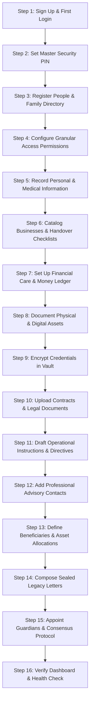
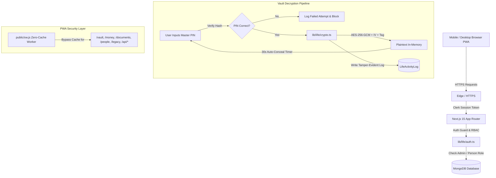

<div align="center">

# 🌿 LIFE

### **Personal Legacy, Secure Information & Business Continuity PWA**

**A private, encrypted personal asset registry, financial ledger, and continuity management system designed for life, emergency preparedness, and peace of mind.**

[](https://nextjs.org/)
[](https://react.dev/)
[](https://www.typescriptlang.org/)
[](https://www.mongodb.com/)
[](https://clerk.com/)
[](https://tailwindcss.com/)
[](https://web.dev/progressive-web-apps/)
[](LICENSE)

*Built as an installable, mobile-first Progressive Web App (PWA) with desktop responsiveness, end-to-end auditability, and military-grade AES-256-GCM vault encryption.*

[Explore Modules](#-core-modules) • [Security Architecture](#-security--encryption-architecture) • [Quick Start](#-quick-start--installation) • [Database Schemas](#️-database-schemas) • [Documentation](docs/APP_DOCUMENTATION.md)

</div>

---

## 📌 Table of Contents

- [💡 About LIFE](#-about-life)
- [✨ Core Modules](#-core-modules)
  - [1. Dashboard & Status Center](#1-dashboard--status-center-)
  - [2. People Directory & Personal Dossiers](#2-people-directory--personal-dossiers-)
  - [3. Money & Debt Ledger](#3-money--debt-ledger-)
  - [4. Encrypted Secrets Vault](#4-encrypted-secrets-vault-)
  - [5. Business Continuity Engine](#5-business-continuity-engine-)
  - [6. Asset Portfolio](#6-asset-portfolio-)
  - [7. Emergency & Key Contacts](#7-emergency--key-contacts-)
  - [8. Critical Documents Library](#8-critical-documents-library-)
  - [9. Legacy Messages & Last Instructions](#9-legacy-messages--last-instructions-)
  - [10. Access Delegation & Emergency Mode](#10-access-delegation--emergency-mode-)
  - [11. Tamper-Evident Activity Audit](#11-tamper-evident-activity-audit-)
  - [12. Settings & Encrypted Backup](#12-settings--encrypted-backup-)
- [🛡️ Security & Encryption Architecture](#️-security--encryption-architecture)
  - [AES-256-GCM Vault Encryption](#aes-256-gcm-vault-encryption)
  - [Master PIN Gate with Timed Concealment](#master-pin-gate-with-timed-concealment)
  - [Zero-Cache Security Service Worker](#zero-cache-security-service-worker)
  - [Multi-Tier Role-Based Access Control (RBAC)](#multi-tier-role-based-access-control-rbac)
  - [Emergency Mode Continuity Trigger](#emergency-mode-continuity-trigger)
- [🛠️ Tech Stack](#️-tech-stack)
- [📁 Project Directory Structure](#-project-directory-structure)
- [🗄️ Database Schemas](#️-database-schemas)
- [🌐 Routes & Permissions Matrix](#-routes--permissions-matrix)
- [⚡ Quick Start & Installation](#-quick-start--installation)
- [📜 NPM Scripts Reference](#-npm-scripts-reference)
- [📄 License & Author](#-license--author)

---

## 💡 About LIFE

**LIFE is not a standard Notes app, nor is it a traditional corporate ERP.**

It is an ultra-private **personal legacy, secure information, money management, and business-continuity platform**. It is designed to solve a fundamental human dilemma:

> *If something happens to you tomorrow, do your loved ones and trusted partners know what assets you own, who owes you money, whom you owe, where critical servers and credentials are, and what immediate steps must be taken to protect your family and business?*

### Key Design Principles:
1. **PWA Mobile-First Feel**: Fluid app bar, bottom navigation (`LifeBottomNav`), glassmorphic modals, and native-feeling gesture surfaces that work seamlessly on iOS, Android, and Desktop.
2. **Confidentiality by Default**: Sensitive records are masked at rest. Secrets are encrypted with **AES-256-GCM** and require a Master Security PIN to reveal.
3. **Zero Browser Leakage**: The Service Worker strictly forbids caching sensitive data in browser caches or Service Worker caches.
4. **Resilient Continuity**: Designate primary and secondary trustees. When Emergency Mode is triggered, designated family members and partners unlock access to continuity plans, legal contacts, and critical operating instructions.

---

## 🚀 Full Admin Lifecycle: End-to-End Flow (Day 1 to Production Readiness)

For system administrators and owners, follow this chronological start-to-end setup roadmap to achieve full operational security and business continuity:



### Complete Chronological Setup Checklist:
1. **Sign Up & First Login**: Create account via Clerk. The initial authenticated user is automatically provisioned as `Super Admin / Owner` with unrestricted system privileges.
2. **Configure Master Security PIN (`/settings`)**: Establish a 4–6 digit Master PIN. This PIN is mandatory to reveal AES-256-GCM vault secrets, alter emergency settings, or execute administrative overrides.
3. **Register People Directory (`/people`)**: Add immediate family (spouse, children, parents, siblings), key business partners, engineering leads, and trusted friends. Include direct contact numbers, WhatsApp, and social profiles (Facebook, Messenger, Instagram, TikTok, Telegram, LinkedIn, YouTube, Website).
4. **Assign Granular Permissions (`/access` or per-person dossier)**: Enforce the principle of least privilege:
   - `canViewPersonal`: Family & medical memos
   - `canViewBusiness`: Corporate notes & server registers
   - `canViewFinancial`: Balances, loans & support ledgers
   - `canViewSensitive`: Confidential deeds & contracts
   - `canRevealVault`: Authority to decrypt vault passwords
   - `canManageAccess`: Permission assignment delegation
   - `canAccessEmergency`: Automatic unlocking upon emergency activation
5. **Record Personal Information (`/information`)**: Enter emergency medical details (blood group, allergies, chronic conditions, regular prescriptions, preferred hospital), identity cards (NID, Passport, Driving License), and tax credentials (e-TIN, Tax Circle).
6. **Catalog Businesses & Handover Checklists (`/business`)**: Record company entities, trade licenses, partner equity percentages, bank signers, and server infrastructure. Fill out the **"If I Am Not Available"** protocol for every venture.
7. **Set Up Financial Tracking (`/finance` & `/money`)**: Record monthly family commitments, loans given, debts payable, capital invested, and incoming partner funds. Log partial/full settlements with receipts.
8. **Catalog Assets & Properties (`/assets`)**: Document real estate, bank deposits, vehicles, gold/valuables, and private equity. Specify percentage ownership and exact physical document storage locations (e.g., *Safe Locker #4B*).
9. **Populate the Encrypted Vault (`/vault`)**: Store high-sensitivity passwords, server root keys, SSH credentials, router logins, recovery seed phrases, and banking PINs under AES-256-GCM encryption.
10. **Archive Critical Documents (`/documents`)**: Upload scanned deeds, incorporation papers, insurance policies, and wills. Tag with physical file locations and access classification tiers.
11. **Write Operational Instructions & Directives (`/instructions`)**: Create clear, step-by-step handover workflows ("What to do", "Who should do it", "In what priority"). Link each directive to assigned persons.
12. **Add Emergency & Professional Contacts (`/contacts`)**: Record family lawyers, primary physicians, tax accountants, bank relationship managers, and system administrators with 1-tap Call, WhatsApp, and Email triggers.
13. **Map Beneficiaries & Inheritance (`/beneficiaries`)**: Allocate assets and percentages to heirs. Attach nominee declarations, share transfer documents, and notarized deeds.
14. **Compose Sealed Legacy Messages (`/legacy`)**: Write private letters, audio/video links, or life advice. Choose triggers: *Emergency Mode Activation*, *Scheduled Future Date*, or *Guardian Release*.
15. **Appoint Trusted Guardians (`/guardians`)**: Designate 2–5 primary and secondary guardians. Configure multi-party consensus thresholds (e.g., 2 of 3 must confirm) and grace period countdown timers (24h/48h/72h).
16. **Review Dashboard & Routine Health Check (`/`)**: Verify continuity indicators, overdue payment notices, guardian statuses, and audit activity.

---

## ✨ Core Modules

### 1. Dashboard & Status Center (`/`)
- **Financial Snapshot**: Real-time aggregation of Money Given, Money Taken, Investments Made, Investments Received, Receivables, and Payables.
- **Continuity Status**: Active / Standby indicator with emergency protocol readiness.
- **Attention Items**: Dynamic alerts for overdue repayments, high-priority emergency instructions, and pending continuity steps.
- **Quick Action Hub**: 1-tap shortcuts to record money, add a contact, log a secret, or create an instruction.

### 2. Businesses & Partnerships (`/business`)
- **Ventures Catalog**: Ownership %, registration numbers, trade licenses, capital invested, and partner stakes.
- **Infrastructure Registry**: Hosting providers, server IPs, control panel URLs, and primary engineering contacts.
- **"If I Am Not Available" Checklist**: Pre-scripted step-by-step operational handover protocols for each venture.

### 3. Personal Information & Identity (`/information`)
- **Emergency Medical Dossier**: Blood group, allergies, chronic ailments, emergency medications, primary physician, and preferred hospital.
- **Identity & Legal Records**: NID, Passport, Birth Certificate, Driving License, e-TIN, and Tax Circle.
- **Emergency Notes & Instructions**: Categorized memos, security directives, and family guidelines.

### 4. Financial Care & Support Ledger (`/finance`, `/finance/[id]`)
- **Family & Dependent Support**: Recurring living allowances, educational expenses, and medical care commitments.
- **Installment Schedules**: Track scheduled payments, due dates, paid amounts, and overdue warnings.
- **Recipient Dossier**: Dedicated financial profile for every dependent with complete historical transaction timeline.

### 5. Money & Debt Ledger (`/money`)
- **Four-Way Tracking**:
  - `Given`: Money lent to others (Receivables).
  - `Taken`: Money borrowed from others (Payables).
  - `Invested Made`: Capital invested in ventures or third parties.
  - `Invested Received`: Capital partners invested into your ventures.
- **Settlement Engine**: Partial or full repayments with automated balance recalculation and timestamped audit receipts.
- **Debt Alerts**: Due date tracking, overdue flags, and direct links to person dossiers.

### 6. People Directory & Personal Dossiers (`/people`, `/people/[id]`)
- **Relationship Matrix**: Track family, business partners, employees, advisors, and trusted friends.
- **Direct Communication & Social Media**: Quick Call (`tel:`), WhatsApp (`wa.me`), Email (`mailto:`), and direct links for Facebook, Messenger, Instagram, TikTok, Telegram, LinkedIn, YouTube, and Website.
- **Lock Controls**: Instantly lock/archive accounts with immediate auth middleware enforcement.
- **8-Tab Comprehensive Dossier**: Overview, Personal Message, Financial History, Documents, Contacts, Responsibilities, Business Directives, and Access Permissions.

### 7. Instructions & Operational Directives (`/instructions`)
- **Handover Directives**: Structured operational instructions with priority weighting (Critical, High, Medium, Low).
- **Assignee Delegation**: Link directives directly to specific individuals from the People Directory.
- **Execution Workflow**: Status tracking (Pending, In Progress, Completed) with verification notes.

### 8. Asset Portfolio & Valuations (`/assets`)
- **Multi-Category Asset Registry**: Real estate, bank deposits/FDRs, vehicles, gold/valuables, and equity.
- **Ownership Breakdown**: Record percentage ownership vs. partner or family stakes.
- **Physical Locations**: Specific storage notation (e.g. *Bank Safe Locker 4B, Almirah 2 Shelf 3*).
- **Document Linking**: Attach title deeds, registration certificates, and purchase invoices.

### 9. Emergency & Professional Contacts (`/contacts`)
- **Categorized Directory**: Immediate Family, Lawyers, Doctors, Accountants, System Engineers, and Key Suppliers.
- **1-Tap Direct Actions**: Phone Call, WhatsApp message, Email compose, and 1-tap clipboard copy.
- **Priority Ranking**: Ordered emergency calling hierarchy for rapid crisis response.

### 10. Critical Documents Library (`/documents`)
- **Secure File Registry**: Digital repository for wills, property deeds, incorporation papers, insurance policies, and tax clearances.
- **Access Tiers**: Standard, Confidential, or Emergency-Only classification.
- **Physical Cross-Referencing**: Notes documenting where the original hardcopy is physically archived.

### 11. Beneficiaries & Asset Allocation (`/beneficiaries`)
- **Inheritance Distribution**: Map heirs to specific assets with percentage allocations.
- **Legal Compliance**: Attach nominee declarations, share transfer forms, and notarized wills.
- **Private Legacy Association**: Link private letters to be delivered upon asset distribution.

### 12. Legacy Messages & Last Instructions (`/legacy`)
- **Condition-Based Sealed Letters**: Intimate farewell messages, life guidance, or private video/audio links.
- **Release Triggers**:
  - `Emergency Only`: Unlocked exclusively when Emergency Mode is triggered.
  - `Admin Can Release`: Manually unlocked by designated executors.
  - `Scheduled Release`: Automatically revealed on or after a specific future date.
- **Distraction-Free Reader**: Immersive, dignified letter reading interface.

### 13. Encrypted Secrets Vault (`/vault`)
- **AES-256-GCM Hardware Encryption**: Passwords, SSH keys, recovery seed phrases, bank credentials, and server logins encrypted at rest with unique IV and authentication tags.
- **Zero Plaintext in Bulk**: Vault list queries return masked fingerprints (`••••••••`).
- **Master PIN Gate**: Decrypting any secret requires entering the Master PIN.
- **30-Second Auto-Conceal**: Revealed secrets count down 30 seconds before automatically purging from browser memory.
- **Tamper-Evident Audit**: Every secret reveal logs actor, IP, timestamp, and target secret name.

### 14. Access Delegation & Emergency Protocol (`/access`, `/guardians`)
- **Emergency Mode Master Switch**: Single-click protocol activation that opens continuity records and legacy directives to designated trustees.
- **Multi-Party Guardian Consensus**: Require $M$-of-$N$ guardians to confirm before emergency mode unlocks.
- **Grace Period Countdown**: Configurable 24h, 48h, or 72h window allowing the owner to cancel accidental or premature emergency triggers.
- **Granular Permissions Grid**: Enable/disable personal, business, financial, sensitive, and vault access per person.

### 15. Activity Audit Trail (`/activity`)
- **Immutable Security Timeline**: Permanent audit trail of all vault reveals, permission edits, emergency activations, and financial settlements.
- **Audit Context**: Captures actor identity, email, role, IP address, resource affected, and precise timestamp.

### 16. Settings, Backup & Trash (`/settings`, `/settings/trash`)
- **Master Security PIN**: Set or update the 4–6 digit Master Security PIN.
- **Encrypted Snapshot Export**: Download complete encrypted JSON backups for offline cold storage.
- **Trash & Soft-Delete Recovery**: Restore accidentally deleted records or permanently erase items.
- **PWA Diagnostics**: Monitor Service Worker registration and local cache state.

---

## 🛡️ Security & Encryption Architecture



### AES-256-GCM Vault Encryption
Vault secrets are encrypted using Node.js native `crypto` with `aes-256-gcm`:
- **Unique IV**: A 16-byte cryptographically secure random Initialization Vector (IV) is generated for every single encrypted record.
- **Authentication Tag**: GCM generates a 16-byte authentication tag ensuring the ciphertext cannot be tampered with in the database.
- **Master Encryption Key**: Derived from `LIFE_VAULT_ENCRYPTION_KEY` via SHA-256 hashing.

### Master PIN Gate with Timed Concealment
- All sensitive reveals require entering the Master PIN.
- Plaintext secrets are never stored in client-side state permanently.
- Upon retrieval, a 30-second timer initiates. Once expired, the secret is wiped from the UI and requires re-authentication.

### Zero-Cache Security Service Worker
The PWA service worker ([public/sw.js](file:///Users/n.i.nazmul/Documents/Working%20Files/life/public/sw.js)) enforces a strict zero-cache policy:
```javascript
// Excerpt from public/sw.js
const SENSITIVE_ROUTES = [
  '/vault', '/money', '/documents', '/people', 
  '/legacy', '/access', '/activity', '/settings', '/api/'
];
// Requests matching these patterns ALWAYS bypass the cache and fetch fresh from network.
```

### Multi-Tier Role-Based Access Control (RBAC)
| Role | Access Level | Description |
| :--- | :--- | :--- |
| **`owner`** / **`super_admin`** | Full Unrestricted | Master of all data, settings, vault decryption, and access delegation |
| **`admin`** | High Operational | Can view all records, edit continuity plans, and trigger emergency mode |
| **`individual`** | Personal & Family | Can only view personal letters, allocated financial notes, and contacts |
| **`business`** | Partner Operational | Can view assigned venture continuity steps, engineer contacts, and server notes |
| **`read_only`** | Gated Viewer | Read-only access to specifically delegated resources |

---

## 🛠️ Tech Stack

| Layer | Technology | Purpose |
| :--- | :--- | :--- |
| **Framework** | [Next.js 16.3 (App Router)](https://nextjs.org/) | Modern server-side rendering, React Server Components & Turbopack (stable) |
| **Frontend UI** | [React 19](https://react.dev/) | Concurrent UI rendering and component state |
| **Language** | [TypeScript 5](https://www.typescriptlang.org/) | End-to-end strict type safety across models, actions, and UI |
| **Authentication** | [Clerk Auth (`@clerk/nextjs`)](https://clerk.com/) | Secure session management, multi-factor auth, and user identity |
| **Database** | [MongoDB](https://www.mongodb.com/) via [Mongoose 8](https://mongoosejs.com/) | Schema validation, compound indexing, and atomic updates |
| **Styling** | [Tailwind CSS 3.4](https://tailwindcss.com/) | Responsive styling, mobile-first design, and dark mode theming |
| **UI Primitives** | [Radix UI](https://www.radix-ui.com/) | Accessible dialogs, dropdowns, tabs, and tooltips |
| **Icons** | [Lucide React](https://lucide.dev/) | Clean, consistent vector iconography |
| **Notifications** | `react-hot-toast` | Lightweight, non-intrusive toast alerts |
| **PWA Engine** | Web App Manifest & Custom SW | Standalone home screen installation with zero-cache data security |

---

## 📁 Project Directory Structure

```
├── app/
│   ├── (auth)/                 # Clerk authentication pages (sign-in, sign-up)
│   ├── (root)/                 # Main authenticated Life application
│   │   ├── layout.tsx          # Life application shell (Header, Sidebar, BottomNav)
│   │   ├── page.tsx            # Dashboard (/): Financials, Continuity, Actions
│   │   ├── people/             # People directory & /people/[id] personal dossier
│   │   ├── money/              # Money ledger: Given, Taken, Invested, Settlements
│   │   ├── information/        # Categorized notes, instructions & emergency data
│   │   ├── business/           # Ventures catalog & "If I Am Not Available" checklist
│   │   ├── assets/             # Asset registry: Real estate, bank deposits, valuables
│   │   ├── contacts/           # Emergency & key contacts directory
│   │   ├── documents/          # Private documents repository
│   │   ├── vault/              # AES-256-GCM encrypted secrets vault
│   │   ├── legacy/             # Sealed legacy messages & release conditions
│   │   ├── access/             # Permissions matrix & Emergency Mode master switch
│   │   ├── activity/           # Tamper-evident security audit timeline
│   │   └── settings/           # Master PIN configuration & encrypted JSON backup
│   ├── access-denied/          # Unauthorized access redirection view
│   ├── globals.css             # Design tokens, theme variables & mobile PWA styles
│   └── layout.tsx              # Root HTML layout with ClerkProvider & ThemeProvider
├── components/
│   └── life/                   # Modular Life UI components
│       ├── layout/             # LifeHeader, LifeSidebar, LifeBottomNav
│       ├── dashboard/          # LifeDashboardClient & metric cards
│       ├── people/             # PeopleClient, PersonDetailClient & 8 dossier tabs
│       ├── money/              # MoneyClient, MoneyFormModal, SettlementModal
│       ├── information/        # InformationClient & InformationModal
│       ├── business/           # BusinessClient, BusinessModal, ContinuityModal
│       ├── assets/             # AssetsClient & AssetModal
│       ├── contacts/           # ContactsClient & ContactModal
│       ├── documents/          # DocumentsClient & DocumentModal
│       ├── vault/              # VaultClient & VaultItemModal
│       ├── legacy/             # LegacyClient & LegacyMessageModal
│       ├── access/             # AccessClient & EmergencyModeModal
│       ├── activity/           # ActivityClient & event timeline
│       ├── settings/           # SettingsClient & MasterPINModal
│       └── shared/             # VaultRevealModal, LifeSearchDialog, ConfirmationDialog
├── lib/
│   ├── actions/                # Next.js Server Actions (all database operations)
│   │   ├── lifeAccess.actions.ts
│   │   ├── lifeActivity.actions.ts
│   │   ├── lifeAsset.actions.ts
│   │   ├── lifeBusiness.actions.ts
│   │   ├── lifeContact.actions.ts
│   │   ├── lifeDashboard.actions.ts
│   │   ├── lifeDocument.actions.ts
│   │   ├── lifeInformation.actions.ts
│   │   ├── lifeLegacy.actions.ts
│   │   ├── lifeMoney.actions.ts
│   │   ├── lifePeople.actions.ts
│   │   ├── lifeSettings.actions.ts
│   │   ├── lifeVault.actions.ts
│   │   └── index.ts
│   ├── database/
│   │   ├── index.ts            # Cached Mongoose connection handler
│   │   └── models/             # Mongoose schemas for all Life entities
│   └── life/
│       ├── auth.ts             # Auth context, RBAC resolution & audit logging
│       └── crypto.ts           # AES-256-GCM encryption & decryption engine
├── public/
│   ├── manifest.json           # Web App Manifest for mobile/desktop PWA installation
│   ├── sw.js                   # Zero-cache security Service Worker
│   └── assets/images/          # Icons, logos, and PWA assets
├── types/
│   └── index.ts                # Master TypeScript interface definitions
└── docs/
    └── APP_DOCUMENTATION.md    # Comprehensive technical & architectural documentation
```

---

## 🗄️ Database Schemas

All entities are modeled with Mongoose under `lib/database/models/`:

| Schema | Model File | Description |
| :--- | :--- | :--- |
| `Admin` | `admin.model.ts` | System administrators and super-admin accounts |
| `LifePerson` | `lifePerson.model.ts` | Individuals, relationships, dossier data, and assigned roles |
| `LifeMoneyRecord` | `lifeMoneyRecord.model.ts` | Receivables, payables, investments, due dates, and returned amounts |
| `LifeSettlement` | `lifeSettlement.model.ts` | Ledger of partial and full return payments |
| `LifeVaultItem` | `lifeVaultItem.model.ts` | Encrypted secrets (AES-256-GCM ciphertext, IV, and auth tag) |
| `LifeBusiness` | `lifeBusiness.model.ts` | Ventures, partner stakes, servers, and continuity checklists |
| `LifeAsset` | `lifeAsset.model.ts` | Real estate, vehicles, financial assets, valuations, and locations |
| `LifeContact` | `lifeContact.model.ts` | Emergency contacts, lawyers, doctors, priority levels |
| `LifeDocument` | `lifeDocument.model.ts` | Critical files, contracts, certificates, and access tiers |
| `LifeLegacyMessage` | `lifeLegacyMessage.model.ts` | Condition-released farewell letters and instructions |
| `LifeInformation` | `lifeInformation.model.ts` | Categorized notes, operational directives, and emergency memos |
| `LifeEmergencyAccess`| `lifeEmergencyAccess.model.ts`| Emergency mode state and delegated trustee access records |
| `LifeActivityLog` | `lifeActivityLog.model.ts` | Tamper-evident immutable audit log of all critical operations |
| `LifeSettings` | `lifeSettings.model.ts` | Master Security PIN hash, emergency contacts, and system config |

---

## 🌐 Routes & Permissions Matrix

| Route | Purpose | Owner / Admin | Trustee / Individual | Business Partner |
| :--- | :--- | :---: | :---: | :---: |
| `/` | Dashboard & Quick Actions | Full View | Delegated Summary | Venture Summary |
| `/guide` | Interactive User Guide & Flow | Full Access | Full Access | Full Access |
| `/business` | Business Continuity & Steps | Full Access | Emergency View | Assigned Ventures |
| `/information` | Personal Info & Medical Records | Full Access | Family View | Hidden |
| `/finance` | Financial Care & Support Ledger | Full Access | View Own Support | Hidden |
| `/finance/[id]` | Dependent Support Dossier | Full Access | View Own Profile | Hidden |
| `/money` | Financial & Debt Ledger | Full Access | View Own Records | View Venture Debts |
| `/people` | People Directory & Profiles | Full Access | View Self / Family | View Team |
| `/people/[id]` | 8-Tab Individual Dossier | Full Access | View Assigned | View Assigned |
| `/instructions`| Operational Handover Directives| Full Access | View Assigned Directives | View Operational Steps |
| `/assets` | Asset Portfolio & Valuation | Full Access | Emergency View | Hidden |
| `/contacts` | Emergency Contacts Directory | Full Access | Full Access | Relevant Contacts |
| `/documents` | Private Documents Library | Full Access | Assigned Docs | Venture Docs |
| `/beneficiaries`| Inheritance & Asset Allocation | Full Access | View Own Allocations | Hidden |
| `/legacy` | Sealed Legacy Letters | Full Access | Condition-Gated | Hidden |
| `/vault` | Encrypted Passwords & Secrets | PIN-Gated Reveal | Hidden (unless granted) | Hidden (unless granted) |
| `/guardians` | Trusted Guardians & Protocol | Full Access | Guardian Status View | Hidden |
| `/access` | Permissions & Emergency Mode | Full Access | View Status | View Status |
| `/activity` | Tamper-Evident Security Log | Full Access | Own Actions Only | Hidden |
| `/settings` | Master PIN & System Backup | Full Access | Read-Only Profile | Read-Only Profile |
| `/settings/trash` | Soft Delete & Trash Recovery | Full Access | Hidden | Hidden |

---

## ⚡ Quick Start & Installation

### Prerequisites
- **Node.js**: v18.17.0 or higher
- **MongoDB**: Local MongoDB instance or MongoDB Atlas URI
- **Clerk Account**: Free tier or higher for user authentication

### Installation Steps

1. **Clone the repository**:
   ```bash
   git clone https://github.com/ninazmul/life.git
   cd life
   ```

2. **Install dependencies**:
   ```bash
   npm install
   ```

3. **Configure environment variables**:
   Create a `.env.local` file in the project root:
   ```env
   # Clerk Authentication
   NEXT_PUBLIC_CLERK_PUBLISHABLE_KEY=pk_test_...
   CLERK_SECRET_KEY=sk_test_...
   NEXT_PUBLIC_CLERK_SIGN_IN_URL=/sign-in
   NEXT_PUBLIC_CLERK_SIGN_UP_URL=/sign-up
   NEXT_PUBLIC_CLERK_AFTER_SIGN_IN_URL=/
   NEXT_PUBLIC_CLERK_AFTER_SIGN_UP_URL=/

   # MongoDB Connection
   MONGODB_URI=mongodb+srv://<username>:<password>@cluster.mongodb.net/life?retryWrites=true&w=majority

   # Encryption (32-character or arbitrary string hashed to 256-bit AES key)
   LIFE_VAULT_ENCRYPTION_KEY=your-secure-32-character-random-encryption-key-here

   # Master Security PIN (Optional initial fallback: default 1234)
   LIFE_MASTER_PIN=1234
   ```

4. **Run the development server**:
   ```bash
   npm run dev
   ```

5. **First-Time Bootstrapping**:
   - Open [http://localhost:3000](http://localhost:3000) in your browser.
   - Complete sign-up through Clerk.
   - The first authenticated user is **automatically provisioned as Super Admin / Owner**.
   - Navigate to `/settings` to configure your **Master Security PIN**.

---

## 📜 NPM Scripts Reference

| Command | Action |
| :--- | :--- |
| `npm run dev` | Starts the Next.js development server with Turbopack |
| `npm run build` | Compiles the production Next.js bundle and verifies TypeScript types |
| `npm run start` | Launches the compiled production application |
| `npm run lint` | Runs ESLint 9 checks across all source code |

---

## 📄 License & Author

Distributed under the **MIT License**. See `LICENSE` for details.

Crafted with care by **[N. I. Nazmul](https://github.com/ninazmul)** (`nazmulsaw@gmail.com`).
