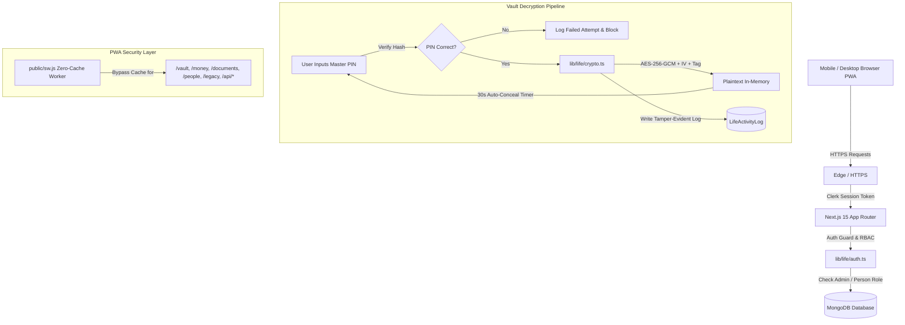

<div align="center">

# 🌿 LIFE

### **Personal Legacy, Secure Information & Business Continuity PWA**

**A private, encrypted personal asset registry, financial ledger, and continuity management system designed for life, emergency preparedness, and peace of mind.**

[](https://nextjs.org/)
[](https://react.dev/)
[](https://www.typescriptlang.org/)
[](https://www.mongodb.com/)
[](https://clerk.com/)
[](https://tailwindcss.com/)
[](https://web.dev/progressive-web-apps/)
[](LICENSE)

*Built as an installable, mobile-first Progressive Web App (PWA) with desktop responsiveness, end-to-end auditability, and military-grade AES-256-GCM vault encryption.*

[Explore Modules](#-core-modules) • [Security Architecture](#-security--encryption-architecture) • [Quick Start](#-quick-start--installation) • [Database Schemas](#️-database-schemas) • [Documentation](docs/APP_DOCUMENTATION.md)

</div>

---

## 📌 Table of Contents

- [💡 About LIFE](#-about-life)
- [✨ Core Modules](#-core-modules)
  - [1. Dashboard & Status Center](#1-dashboard--status-center-)
  - [2. People Directory & Personal Dossiers](#2-people-directory--personal-dossiers-)
  - [3. Money & Debt Ledger](#3-money--debt-ledger-)
  - [4. Encrypted Secrets Vault](#4-encrypted-secrets-vault-)
  - [5. Business Continuity Engine](#5-business-continuity-engine-)
  - [6. Asset Portfolio](#6-asset-portfolio-)
  - [7. Emergency & Key Contacts](#7-emergency--key-contacts-)
  - [8. Critical Documents Library](#8-critical-documents-library-)
  - [9. Legacy Messages & Last Instructions](#9-legacy-messages--last-instructions-)
  - [10. Access Delegation & Emergency Mode](#10-access-delegation--emergency-mode-)
  - [11. Tamper-Evident Activity Audit](#11-tamper-evident-activity-audit-)
  - [12. Settings & Encrypted Backup](#12-settings--encrypted-backup-)
- [🛡️ Security & Encryption Architecture](#️-security--encryption-architecture)
  - [AES-256-GCM Vault Encryption](#aes-256-gcm-vault-encryption)
  - [Master PIN Gate with Timed Concealment](#master-pin-gate-with-timed-concealment)
  - [Zero-Cache Security Service Worker](#zero-cache-security-service-worker)
  - [Multi-Tier Role-Based Access Control (RBAC)](#multi-tier-role-based-access-control-rbac)
  - [Emergency Mode Continuity Trigger](#emergency-mode-continuity-trigger)
- [🛠️ Tech Stack](#️-tech-stack)
- [📁 Project Directory Structure](#-project-directory-structure)
- [🗄️ Database Schemas](#️-database-schemas)
- [🌐 Routes & Permissions Matrix](#-routes--permissions-matrix)
- [⚡ Quick Start & Installation](#-quick-start--installation)
- [📜 NPM Scripts Reference](#-npm-scripts-reference)
- [📄 License & Author](#-license--author)

---

## 💡 About LIFE

**LIFE is not a standard Notes app, nor is it a traditional corporate ERP.**

It is an ultra-private **personal legacy, secure information, money management, and business-continuity platform**. It is designed to solve a fundamental human dilemma:

> *If something happens to you tomorrow, do your loved ones and trusted partners know what assets you own, who owes you money, whom you owe, where critical servers and credentials are, and what immediate steps must be taken to protect your family and business?*

### Key Design Principles:
1. **PWA Mobile-First Feel**: Fluid app bar, bottom navigation (`LifeBottomNav`), glassmorphic modals, and native-feeling gesture surfaces that work seamlessly on iOS, Android, and Desktop.
2. **Confidentiality by Default**: Sensitive records are masked at rest. Secrets are encrypted with **AES-256-GCM** and require a Master Security PIN to reveal.
3. **Zero Browser Leakage**: The Service Worker strictly forbids caching sensitive data in browser caches or Service Worker caches.
4. **Resilient Continuity**: Designate primary and secondary trustees. When Emergency Mode is triggered, designated family members and partners unlock access to continuity plans, legal contacts, and critical operating instructions.

---

## ✨ Core Modules

### 1. Dashboard & Status Center (`/`)
- **Financial Snapshot**: Real-time aggregation of Money Given, Money Taken, Investments, and Net Outstanding Balance.
- **Continuity Status**: Active / Standby indicator with direct emergency trigger access.
- **Attention Items**: Dynamic alerts for overdue repayments, high-priority emergency instructions, and pending continuity steps.
- **Quick Action Hub**: 1-tap shortcuts to record money, add a contact, log a secret, or create an instruction.

### 2. People Directory & Personal Dossiers (`/people`, `/people/[id]`)
- **Relationship Matrix**: Track family members, business partners, engineers, staff, advisors, and trusted friends.
- **Status & Lock Controls**: Active, Locked, or Archived status. A locked person is immediately rejected by auth middleware.
- **Comprehensive 8-Tab Dossier**:
  - **Overview**: Core profile, avatar, relation, and contact actions.
  - **Personal Message**: Private, intimate message intended specifically for this individual.
  - **Financial**: Linked money records (given/taken/invested) with outstanding balances.
  - **Documents**: Sensitive contracts, agreements, and IDs linked to this person.
  - **Contacts**: Emergency and advisory contacts relevant to this relationship.
  - **Responsibilities**: Bulleted task lists and delegations assigned to them.
  - **Business Instructions**: Operational steps and protocols they need to follow.
  - **Access Rules**: Per-person granular permission toggles.

### 3. Money & Debt Ledger (`/money`)
- **Complete Four-Way Tracking**:
  - `Given`: Money you lent to others (Receivables).
  - `Taken`: Money you borrowed from others (Payables).
  - `Invested Made`: Capital you invested in ventures or partnerships.
  - `Invested Received`: Capital partners invested in your ventures.
- **Settlement Engine**: Record partial or full return payments with automated balance updates and timestamped settlement logs.
- **Debt Tracking**: Interest notes, repayment due dates, and linked person lookups.

### 4. Encrypted Secrets Vault (`/vault`)
- **AES-256-GCM Encrypted Storage**: Passwords, server root keys, recovery seed phrases, bank credentials, and router logins are encrypted at rest with unique Initialization Vectors (IV) and authentication tags.
- **Plaintext Never Leaves the Server in Bulk**: Vault list queries return masked fingerprints (`••••••••`).
- **Master PIN Verification**: Decrypting a secret requires entering the Master PIN.
- **Auto-Concealing Timer**: Revealed secrets display an animated 30-second countdown before automatically vanishing from memory.
- **Tamper-Evident Logging**: Every secret reveal is permanently logged with the viewer's identity and timestamp.

### 5. Business Continuity Engine (`/business`)
- **Ventures Catalog**: Maintain detailed ownership %, legal entities, and active partner stakes.
- **Infrastructure Registry**: Record hosting providers, server IPs, control panel URLs, and primary server engineer contacts.
- **"If I Am Not Available" Contingency Checklist**: Pre-scripted step-by-step instructions (e.g., who to pay for domain renewal, who to contact to keep servers online, how to handle client inquiries).

### 6. Asset Portfolio (`/assets`)
- **Multi-Asset Registry**: Properties, real estate, bank deposits, vehicles, gold/valuables, and private equity.
- **Ownership Breakdown**: Record personal percentage ownership vs. partner or family stakes.
- **Document Association**: Link title deeds, registration certificates, and purchase receipts.

### 7. Emergency & Key Contacts (`/contacts`)
- **Categorized Directory**: Immediate Family, Lawyers, Doctors, Accountants, System Engineers, and Key Suppliers.
- **1-Tap Direct Action**: Direct Call (`tel:`), direct WhatsApp (`https://wa.me/`), direct Email (`mailto:`), and 1-tap phone copy.
- **Emergency Priority**: Ranked calling order for crisis situations.

### 8. Critical Documents Library (`/documents`)
- **Private Repository**: Store wills, title deeds, insurance policies, company incorporation papers, and tax files.
- **Access Gating**: Mark documents as Standard, Confidential, or Emergency-Only.

### 9. Legacy Messages & Last Instructions (`/legacy`)
- **Condition-Based Release**: Write sealed letters and video/file instructions for specific people.
- **Release Conditions**:
  - `Emergency Only`: Unlocked exclusively when Emergency Mode is active.
  - `Admin Can Release`: Manually unlocked by designated administrators.
  - `Scheduled Release`: Unlocked after a specific future calendar date.
- **Interactive Reader**: Immersive, distraction-free letter reader interface.

### 10. Access Delegation & Emergency Mode (`/access`)
- **Emergency Mode Master Switch**: A single button activates Emergency Mode across the entire platform, opening continuity protocols and legacy letters to designated trustees.
- **Primary & Secondary Admin Delegation**: Appoint trusted executors who gain administrative rights in emergencies.
- **Granular Permissions Grid**: Enable/disable access to personal notes, business records, financial balances, sensitive files, and vault reveals on a per-user basis.

### 11. Tamper-Evident Activity Audit (`/activity`)
- **Immutable Security Timeline**: Records every critical event—Vault item decrypted, Emergency Mode activated, Money record settled, or Access permissions modified.
- **Audit Metadata**: Captures Actor Name, Actor Email, Role, IP context, Resource Name, and exact timestamp.

### 12. Settings & Encrypted Backup (`/settings`)
- **Master Security PIN Setup**: Set or change the 4-to-6 digit Master Security PIN protecting vault items and sensitive actions.
- **Encrypted JSON Export**: Generate a complete system snapshot backup for offline cold-storage.
- **PWA Health & Cache Diagnostics**: Monitor service worker registration and local storage integrity.

---

## 🛡️ Security & Encryption Architecture



### AES-256-GCM Vault Encryption
Vault secrets are encrypted using Node.js native `crypto` with `aes-256-gcm`:
- **Unique IV**: A 16-byte cryptographically secure random Initialization Vector (IV) is generated for every single encrypted record.
- **Authentication Tag**: GCM generates a 16-byte authentication tag ensuring the ciphertext cannot be tampered with in the database.
- **Master Encryption Key**: Derived from `LIFE_VAULT_ENCRYPTION_KEY` via SHA-256 hashing.

### Master PIN Gate with Timed Concealment
- All sensitive reveals require entering the Master PIN.
- Plaintext secrets are never stored in client-side state permanently.
- Upon retrieval, a 30-second timer initiates. Once expired, the secret is wiped from the UI and requires re-authentication.

### Zero-Cache Security Service Worker
The PWA service worker ([public/sw.js](file:///Users/n.i.nazmul/Documents/Working%20Files/life/public/sw.js)) enforces a strict zero-cache policy:
```javascript
// Excerpt from public/sw.js
const SENSITIVE_ROUTES = [
  '/vault', '/money', '/documents', '/people', 
  '/legacy', '/access', '/activity', '/settings', '/api/'
];
// Requests matching these patterns ALWAYS bypass the cache and fetch fresh from network.
```

### Multi-Tier Role-Based Access Control (RBAC)
| Role | Access Level | Description |
| :--- | :--- | :--- |
| **`owner`** / **`super_admin`** | Full Unrestricted | Master of all data, settings, vault decryption, and access delegation |
| **`admin`** | High Operational | Can view all records, edit continuity plans, and trigger emergency mode |
| **`individual`** | Personal & Family | Can only view personal letters, allocated financial notes, and contacts |
| **`business`** | Partner Operational | Can view assigned venture continuity steps, engineer contacts, and server notes |
| **`read_only`** | Gated Viewer | Read-only access to specifically delegated resources |

---

## 🛠️ Tech Stack

| Layer | Technology | Purpose |
| :--- | :--- | :--- |
| **Framework** | [Next.js 16.3 (App Router)](https://nextjs.org/) | Modern server-side rendering, React Server Components & Turbopack (stable) |
| **Frontend UI** | [React 19](https://react.dev/) | Concurrent UI rendering and component state |
| **Language** | [TypeScript 5](https://www.typescriptlang.org/) | End-to-end strict type safety across models, actions, and UI |
| **Authentication** | [Clerk Auth (`@clerk/nextjs`)](https://clerk.com/) | Secure session management, multi-factor auth, and user identity |
| **Database** | [MongoDB](https://www.mongodb.com/) via [Mongoose 8](https://mongoosejs.com/) | Schema validation, compound indexing, and atomic updates |
| **Styling** | [Tailwind CSS 3.4](https://tailwindcss.com/) | Responsive styling, mobile-first design, and dark mode theming |
| **UI Primitives** | [Radix UI](https://www.radix-ui.com/) | Accessible dialogs, dropdowns, tabs, and tooltips |
| **Icons** | [Lucide React](https://lucide.dev/) | Clean, consistent vector iconography |
| **Notifications** | `react-hot-toast` | Lightweight, non-intrusive toast alerts |
| **PWA Engine** | Web App Manifest & Custom SW | Standalone home screen installation with zero-cache data security |

---

## 📁 Project Directory Structure

```
├── app/
│   ├── (auth)/                 # Clerk authentication pages (sign-in, sign-up)
│   ├── (root)/                 # Main authenticated Life application
│   │   ├── layout.tsx          # Life application shell (Header, Sidebar, BottomNav)
│   │   ├── page.tsx            # Dashboard (/): Financials, Continuity, Actions
│   │   ├── people/             # People directory & /people/[id] personal dossier
│   │   ├── money/              # Money ledger: Given, Taken, Invested, Settlements
│   │   ├── information/        # Categorized notes, instructions & emergency data
│   │   ├── business/           # Ventures catalog & "If I Am Not Available" checklist
│   │   ├── assets/             # Asset registry: Real estate, bank deposits, valuables
│   │   ├── contacts/           # Emergency & key contacts directory
│   │   ├── documents/          # Private documents repository
│   │   ├── vault/              # AES-256-GCM encrypted secrets vault
│   │   ├── legacy/             # Sealed legacy messages & release conditions
│   │   ├── access/             # Permissions matrix & Emergency Mode master switch
│   │   ├── activity/           # Tamper-evident security audit timeline
│   │   └── settings/           # Master PIN configuration & encrypted JSON backup
│   ├── access-denied/          # Unauthorized access redirection view
│   ├── globals.css             # Design tokens, theme variables & mobile PWA styles
│   └── layout.tsx              # Root HTML layout with ClerkProvider & ThemeProvider
├── components/
│   └── life/                   # Modular Life UI components
│       ├── layout/             # LifeHeader, LifeSidebar, LifeBottomNav
│       ├── dashboard/          # LifeDashboardClient & metric cards
│       ├── people/             # PeopleClient, PersonDetailClient & 8 dossier tabs
│       ├── money/              # MoneyClient, MoneyFormModal, SettlementModal
│       ├── information/        # InformationClient & InformationModal
│       ├── business/           # BusinessClient, BusinessModal, ContinuityModal
│       ├── assets/             # AssetsClient & AssetModal
│       ├── contacts/           # ContactsClient & ContactModal
│       ├── documents/          # DocumentsClient & DocumentModal
│       ├── vault/              # VaultClient & VaultItemModal
│       ├── legacy/             # LegacyClient & LegacyMessageModal
│       ├── access/             # AccessClient & EmergencyModeModal
│       ├── activity/           # ActivityClient & event timeline
│       ├── settings/           # SettingsClient & MasterPINModal
│       └── shared/             # VaultRevealModal, LifeSearchDialog, ConfirmationDialog
├── lib/
│   ├── actions/                # Next.js Server Actions (all database operations)
│   │   ├── lifeAccess.actions.ts
│   │   ├── lifeActivity.actions.ts
│   │   ├── lifeAsset.actions.ts
│   │   ├── lifeBusiness.actions.ts
│   │   ├── lifeContact.actions.ts
│   │   ├── lifeDashboard.actions.ts
│   │   ├── lifeDocument.actions.ts
│   │   ├── lifeInformation.actions.ts
│   │   ├── lifeLegacy.actions.ts
│   │   ├── lifeMoney.actions.ts
│   │   ├── lifePeople.actions.ts
│   │   ├── lifeSettings.actions.ts
│   │   ├── lifeVault.actions.ts
│   │   └── index.ts
│   ├── database/
│   │   ├── index.ts            # Cached Mongoose connection handler
│   │   └── models/             # Mongoose schemas for all Life entities
│   └── life/
│       ├── auth.ts             # Auth context, RBAC resolution & audit logging
│       └── crypto.ts           # AES-256-GCM encryption & decryption engine
├── public/
│   ├── manifest.json           # Web App Manifest for mobile/desktop PWA installation
│   ├── sw.js                   # Zero-cache security Service Worker
│   └── assets/images/          # Icons, logos, and PWA assets
├── types/
│   └── index.ts                # Master TypeScript interface definitions
└── docs/
    └── APP_DOCUMENTATION.md    # Comprehensive technical & architectural documentation
```

---

## 🗄️ Database Schemas

All entities are modeled with Mongoose under `lib/database/models/`:

| Schema | Model File | Description |
| :--- | :--- | :--- |
| `Admin` | `admin.model.ts` | System administrators and super-admin accounts |
| `LifePerson` | `lifePerson.model.ts` | Individuals, relationships, dossier data, and assigned roles |
| `LifeMoneyRecord` | `lifeMoneyRecord.model.ts` | Receivables, payables, investments, due dates, and returned amounts |
| `LifeSettlement` | `lifeSettlement.model.ts` | Ledger of partial and full return payments |
| `LifeVaultItem` | `lifeVaultItem.model.ts` | Encrypted secrets (AES-256-GCM ciphertext, IV, and auth tag) |
| `LifeBusiness` | `lifeBusiness.model.ts` | Ventures, partner stakes, servers, and continuity checklists |
| `LifeAsset` | `lifeAsset.model.ts` | Real estate, vehicles, financial assets, valuations, and locations |
| `LifeContact` | `lifeContact.model.ts` | Emergency contacts, lawyers, doctors, priority levels |
| `LifeDocument` | `lifeDocument.model.ts` | Critical files, contracts, certificates, and access tiers |
| `LifeLegacyMessage` | `lifeLegacyMessage.model.ts` | Condition-released farewell letters and instructions |
| `LifeInformation` | `lifeInformation.model.ts` | Categorized notes, operational directives, and emergency memos |
| `LifeEmergencyAccess`| `lifeEmergencyAccess.model.ts`| Emergency mode state and delegated trustee access records |
| `LifeActivityLog` | `lifeActivityLog.model.ts` | Tamper-evident immutable audit log of all critical operations |
| `LifeSettings` | `lifeSettings.model.ts` | Master Security PIN hash, emergency contacts, and system config |

---

## 🌐 Routes & Permissions Matrix

| Route | Purpose | Owner / Admin | Trustee / Individual | Business Partner |
| :--- | :--- | :---: | :---: | :---: |
| `/` | Dashboard & Quick Actions | Full View | Delegated Summary | Venture Summary |
| `/people` | People Directory & Profiles | Full Access | View Self / Family | View Team |
| `/people/[id]` | 8-Tab Individual Dossier | Full Access | View Assigned | View Assigned |
| `/money` | Financial & Debt Ledger | Full Access | View Own Records | View Venture Debts |
| `/vault` | Encrypted Passwords & Secrets | PIN-Gated Reveal | Hidden (unless granted) | Hidden (unless granted) |
| `/business` | Business Continuity & Steps | Full Access | Emergency View | Assigned Ventures |
| `/assets` | Asset Portfolio & Valuation | Full Access | Emergency View | Hidden |
| `/contacts` | Emergency Contacts Directory | Full Access | Full Access | Relevant Contacts |
| `/documents` | Private Documents Library | Full Access | Assigned Docs | Venture Docs |
| `/legacy` | Sealed Legacy Letters | Full Access | Condition-Gated | Hidden |
| `/access` | Permissions & Emergency Mode | Full Access | View Status | View Status |
| `/activity` | Tamper-Evident Security Log | Full Access | Own Actions Only | Hidden |
| `/settings` | Master PIN & System Backup | Full Access | Read-Only Profile | Read-Only Profile |

---

## ⚡ Quick Start & Installation

### Prerequisites
- **Node.js**: v18.17.0 or higher
- **MongoDB**: Local MongoDB instance or MongoDB Atlas URI
- **Clerk Account**: Free tier or higher for user authentication

### Installation Steps

1. **Clone the repository**:
   ```bash
   git clone https://github.com/ninazmul/life.git
   cd life
   ```

2. **Install dependencies**:
   ```bash
   npm install
   ```

3. **Configure environment variables**:
   Create a `.env.local` file in the project root:
   ```env
   # Clerk Authentication
   NEXT_PUBLIC_CLERK_PUBLISHABLE_KEY=pk_test_...
   CLERK_SECRET_KEY=sk_test_...
   NEXT_PUBLIC_CLERK_SIGN_IN_URL=/sign-in
   NEXT_PUBLIC_CLERK_SIGN_UP_URL=/sign-up
   NEXT_PUBLIC_CLERK_AFTER_SIGN_IN_URL=/
   NEXT_PUBLIC_CLERK_AFTER_SIGN_UP_URL=/

   # MongoDB Connection
   MONGODB_URI=mongodb+srv://<username>:<password>@cluster.mongodb.net/life?retryWrites=true&w=majority

   # Encryption (32-character or arbitrary string hashed to 256-bit AES key)
   LIFE_VAULT_ENCRYPTION_KEY=your-secure-32-character-random-encryption-key-here

   # Master Security PIN (Optional initial fallback: default 1234)
   LIFE_MASTER_PIN=1234
   ```

4. **Run the development server**:
   ```bash
   npm run dev
   ```

5. **First-Time Bootstrapping**:
   - Open [http://localhost:3000](http://localhost:3000) in your browser.
   - Complete sign-up through Clerk.
   - The first authenticated user is **automatically provisioned as Super Admin / Owner**.
   - Navigate to `/settings` to configure your **Master Security PIN**.

---

## 📜 NPM Scripts Reference

| Command | Action |
| :--- | :--- |
| `npm run dev` | Starts the Next.js development server with Turbopack |
| `npm run build` | Compiles the production Next.js bundle and verifies TypeScript types |
| `npm run start` | Launches the compiled production application |
| `npm run lint` | Runs ESLint 9 checks across all source code |

---

## 📄 License & Author

Distributed under the **MIT License**. See `LICENSE` for details.

Crafted with care by **[N. I. Nazmul](https://github.com/ninazmul)** (`nazmulsaw@gmail.com`).
