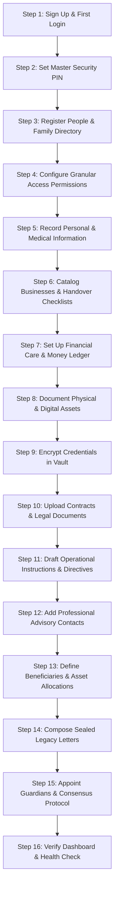

# LIFE — Technical Architecture & System Documentation

**Personal Legacy, Secure Information, Financial Care & Business Continuity PWA**

---

## 1. Executive Overview & System Philosophy

**LIFE** is a private, encrypted personal asset registry, financial care ledger, business continuity engine, and legacy management system.

### What LIFE Is Not
- **Not a generic Notes App**: Traditional note apps lack relational people dossiers, structured financial debts, server infrastructure inventories, multi-party consensus protocols, and granular access delegation.
- **Not a standard corporate ERP**: Traditional ERPs are bloated with supply chain, inventory, and point-of-sale features irrelevant to personal life, family protection, and private business ventures.

### What LIFE Is
LIFE is an ultra-secure, mobile-first single source of truth designed for the Owner. It solves the fundamental human dilemma:
> *If something happens to you tomorrow, do your loved ones and trusted partners know what assets you own, who owes you money, whom you owe, where critical servers and credentials are, and what immediate steps must be taken to protect your family and business?*

In the event of an emergency, incapacity, or death, designated guardians, trustees, family members, and business partners have instant clarity regarding:
1. **Assets & Liabilities**: Receivables, debts, real estate, bank deposits, private equity, and recurring dependent care support.
2. **Critical Operational Directives**: Server maintenance, domain renewals, vendor payments, and step-by-step continuity instructions.
3. **Emergency Communications**: Categorized directory of immediate family, primary physicians, corporate lawyers, tax accountants, and system engineers with 1-tap direct Call, WhatsApp, and Email triggers.
4. **Encrypted Secrets & Documents**: Passwords, server SSH root keys, crypto seed phrases, bank PINs, title deeds, trade licenses, and condition-sealed legacy letters.

The platform functions as an installable **Progressive Web App (PWA)** with a native feel on iOS and Android, while delivering a comprehensive desktop experience.

---

## 2. Technology Stack & Directory Architecture

### Core Technologies
- **Framework**: [Next.js 16.3.4 (App Router)](https://nextjs.org/) with Turbopack (stable)
- **Frontend**: [React 19](https://react.dev/) (Server Components + interactive Client Components)
- **Language**: [TypeScript 5](https://www.typescriptlang.org/) (Strict mode with end-to-end typing)
- **Styling**: [Tailwind CSS 3.4](https://tailwindcss.com/) + [Radix UI Primitives](https://www.radix-ui.com/) + [Lucide React](https://lucide.dev/)
- **Theme**: `next-themes` (Dark Mode / Light Mode with CSS custom properties)
- **Database**: [MongoDB](https://www.mongodb.com/) with [Mongoose 8](https://mongoosejs.com/) (Connection pooling, schema validation, compound indexes, soft deletes)
- **Authentication**: [Clerk Auth (`@clerk/nextjs`)](https://clerk.com/)
- **Cryptography**: Node.js `crypto` with `aes-256-gcm` authenticated symmetric encryption
- **PWA**: Web App Manifest (`public/manifest.json`) and Zero-Cache Security Service Worker (`public/sw.js`)

### Directory Structure

```
├── app/
│   ├── (auth)/                          # Clerk authentication routes
│   │   ├── sign-in/[[...sign-in]]/      # Clerk Sign-In Page
│   │   └── sign-up/[[...sign-up]]/      # Clerk Sign-Up Page
│   ├── (root)/                          # Authenticated application shell
│   │   ├── layout.tsx                   # Master App Shell (Header, Sidebar, BottomNav, PWAProvider)
│   │   ├── page.tsx                     # Dashboard (/)
│   │   ├── guide/page.tsx               # Interactive User Guide & Flow (/guide)
│   │   ├── business/page.tsx            # Business Continuity & Ventures (/business)
│   │   ├── information/page.tsx         # Personal Medical & Legal Identity (/information)
│   │   ├── finance/                     # Financial Care & Dependent Support
│   │   │   ├── page.tsx                 # Master Financial Care Ledger (/finance)
│   │   │   └── [id]/page.tsx            # Dependent Support Dossier (/finance/[id])
│   │   ├── money/page.tsx               # Money & Debt Ledger (/money)
│   │   ├── people/                      # People Directory
│   │   │   ├── page.tsx                 # People list & filter view (/people)
│   │   │   └── [id]/page.tsx            # 8-Tab Individual Dossier (/people/[id])
│   │   ├── instructions/page.tsx        # Operational Directives & Tasks (/instructions)
│   │   ├── assets/page.tsx              # Asset Portfolio Registry (/assets)
│   │   ├── contacts/page.tsx            # Emergency & Key Contacts Directory (/contacts)
│   │   ├── documents/page.tsx           # Critical Documents Library (/documents)
│   │   ├── beneficiaries/page.tsx       # Beneficiaries & Asset Allocation (/beneficiaries)
│   │   ├── legacy/page.tsx              # Sealed Legacy Letters & Last Messages (/legacy)
│   │   ├── vault/page.tsx               # AES-256-GCM Encrypted Secrets Vault (/vault)
│   │   ├── guardians/page.tsx           # Trusted Guardians & Consensus Protocol (/guardians)
│   │   ├── access/page.tsx              # Permissions Grid & Emergency Mode (/access)
│   │   ├── activity/page.tsx            # Tamper-Evident Security Audit Log (/activity)
│   │   └── settings/                    # System Settings
│   │       ├── page.tsx                 # Master PIN & System Export (/settings)
│   │       └── trash/page.tsx           # Soft-Delete Trash Recovery (/settings/trash)
│   ├── access-denied/page.tsx           # Unauthorized access fallback
│   ├── globals.css                      # Design tokens, theme variables & mobile PWA styles
│   └── layout.tsx                       # Root HTML layout with ClerkProvider & ThemeProvider
├── components/
│   └── life/                            # Life application component library
│       ├── layout/                      # LifeHeader, LifeSidebar, LifeBottomNav
│       ├── dashboard/                   # LifeDashboardClient & metric widgets
│       ├── guide/                       # UserGuideClient (End-to-End Onboarding)
│       ├── business/                    # BusinessClient, BusinessModal, ContinuityModal
│       ├── information/                 # InformationClient, InformationModal
│       ├── finance/                     # FinancialSupportClient, InstallmentModal
│       ├── money/                       # MoneyClient, MoneyFormModal, SettlementModal
│       ├── people/                      # PeopleClient, PersonDetailClient, PersonFormModal
│       ├── instructions/                # InstructionClient, InstructionModal
│       ├── assets/                      # AssetsClient, AssetModal
│       ├── contacts/                    # ContactsClient, ContactModal
│       ├── documents/                   # DocumentsClient, DocumentModal
│       ├── beneficiaries/               # BeneficiaryClient, BeneficiaryModal
│       ├── legacy/                      # LegacyClient, LegacyMessageModal, LegacyReader
│       ├── vault/                       # VaultClient, VaultItemModal
│       ├── guardians/                   # GuardianClient, GuardianModal, ConsensusModal
│       ├── access/                      # AccessClient, EmergencyModeModal
│       ├── activity/                    # ActivityClient, AuditTimeline
│       ├── settings/                    # SettingsClient, MasterPINModal, TrashClient
│       ├── shared/                      # VaultRevealModal, LifeSearchDialog, ConfirmationDialog
│       └── PWAProvider.tsx              # PWA lifecycle, offline indicator & install prompt
├── lib/
│   ├── actions/                         # Next.js Server Actions (All Database Operations)
│   │   ├── index.ts                     # Barrel re-export
│   │   ├── lifeAccess.actions.ts        # Access control, delegation & emergency switch
│   │   ├── lifeActivity.actions.ts      # Immutable activity audit logging
│   │   ├── lifeAsset.actions.ts         # Asset portfolio operations
│   │   ├── lifeBeneficiary.actions.ts   # Beneficiary allocations & documents
│   │   ├── lifeBusiness.actions.ts      # Business ventures & continuity steps
│   │   ├── lifeContact.actions.ts       # Emergency contacts CRUD
│   │   ├── lifeDashboard.actions.ts     # Aggregated metrics & attention queries
│   │   ├── lifeDocument.actions.ts      # Documents CRUD & access tiers
│   │   ├── lifeEmergencyRequest.actions.ts # Multi-party consensus emergency requests
│   │   ├── lifeFinancialSupport.actions.ts # Dependent support & installments
│   │   ├── lifeGuardian.actions.ts      # Guardian appointments & verification
│   │   ├── lifeInformation.actions.ts   # Medical & personal identity records
│   │   ├── lifeInstruction.actions.ts   # Operational directives & delegations
│   │   ├── lifeLegacy.actions.ts        # Legacy messages & release conditions
│   │   ├── lifeMoney.actions.ts         # Money records, settlements & calculations
│   │   ├── lifePeople.actions.ts        # People directory & 8-tab dossier data
│   │   ├── lifeResponsibility.actions.ts# Delegated responsibility tracking
│   │   ├── lifeSettings.actions.ts      # Master PIN, system settings & JSON export
│   │   ├── lifeTrash.actions.ts         # Soft-delete trash management & restoration
│   │   └── lifeVault.actions.ts         # Vault secrets CRUD & decrypt action
│   ├── database/
│   │   ├── index.ts                     # Cached MongoDB connection handler
│   │   └── models/                      # 26 Mongoose Data Models
│   └── life/
│       ├── auth.ts                      # Server-side auth context, RBAC & audit helper
│       └── crypto.ts                    # AES-256-GCM cipher/decipher implementation
├── public/
│   ├── manifest.json                    # Web App Manifest for mobile installation
│   ├── sw.js                            # Zero-cache security Service Worker
│   └── assets/images/                   # Logos, icons, and avatars
└── types/
    └── index.ts                         # Universal TypeScript interfaces & enums
```

---

## 3. Full Admin Lifecycle: End-to-End Setup Roadmap

For system administrators and owners, follow this chronological start-to-end setup roadmap to achieve full operational security and business continuity:



### Detailed Chronological Steps

1. **Step 1 → Sign Up & First Login**
   - Create account via Clerk using email or Google SSO.
   - The first authenticated user is automatically provisioned as `super_admin` / Owner in MongoDB.
   - The Owner has unrestricted access to all modules, settings, and database collections.

2. **Step 2 → Configure Master Security PIN (`/settings`)**
   - Establish a 4–6 digit Master Security PIN.
   - The PIN is hashed using SHA-256 and stored in `LifeSettings`.
   - The PIN is strictly required to reveal AES-256-GCM vault secrets, alter emergency settings, or execute administrative overrides.

3. **Step 3 → Register People Directory (`/people`)**
   - Add immediate family (spouse, children, parents, siblings), key business partners, engineering leads, and trusted friends.
   - Record phone, WhatsApp, email, and social channels (Facebook, Messenger, Instagram, TikTok, Telegram, LinkedIn, YouTube, Website).
   - Designate relationship role: Family Member, Business Partner, Responsible Person, Beneficiary, Trusted Guardian, or Administrator.

4. **Step 4 → Assign Granular Permissions (`/access` or per-person dossier)**
   - Enforce the principle of least privilege:
     - `canViewPersonal`: Family & medical memos
     - `canViewBusiness`: Corporate notes & server registers
     - `canViewFinancial`: Balances, loans & support ledgers
     - `canViewSensitive`: Confidential deeds & contracts
     - `canRevealVault`: Authority to decrypt vault passwords
     - `canManageAccess`: Permission assignment delegation
     - `canAccessEmergency`: Automatic unlocking upon emergency activation

5. **Step 5 → Record Personal & Medical Information (`/information`)**
   - Medical Dossier: Blood group, allergies, chronic ailments, emergency medications, primary physician, and preferred hospital.
   - Identity Cards: NID, Passport, Birth Certificate, Driving License.
   - Tax Credentials: e-TIN, Tax Circle, zone, and assessment notes.

6. **Step 6 → Catalog Businesses & Handover Checklists (`/business`)**
   - Corporate Entities: Legal business name, trade license, registration number, partner equity percentages, and capital invested.
   - Infrastructure Registry: Server IPs, hosting providers, control panel URLs, and primary server engineer contacts.
   - **"If I Am Not Available"** Protocol: Pre-scripted step-by-step continuity checklist (e.g., who to pay for domain renewal, who to contact to keep servers online, how to handle client inquiries).

7. **Step 7 → Set Up Financial Care & Money Ledger (`/finance` & `/money`)**
   - **Financial Care (`/finance`)**: Record recurring dependent living allowances, educational stipends, and medical funds. Schedule monthly installment due dates.
   - **Money Ledger (`/money`)**: Log 4-way financial records:
     - `Given`: Money lent to others (Receivables).
     - `Taken`: Money borrowed from others (Payables).
     - `Invested Made`: Capital invested in ventures or partnerships.
     - `Invested Received`: Capital partners invested into your ventures.
   - Record partial or full settlements with payment receipts and timestamped audit logs.

8. **Step 8 → Catalog Assets & Properties (`/assets`)**
   - Real estate properties, bank deposits/FDRs, vehicles, gold/jewelry, and private equity.
   - Specify purchase value, current estimated valuation, ownership stake, and exact physical document locations (e.g. *Bank Safe Locker 4B, Almirah #2*).

9. **Step 9 → Populate the Encrypted Secrets Vault (`/vault`)**
   - Store high-sensitivity passwords, server root keys, SSH credentials, router logins, recovery seed phrases, and banking PINs.
   - Secrets are encrypted with AES-256-GCM. Plaintext never leaves the server in bulk.
   - Secret reveals require Master PIN verification and feature an animated 30-second auto-concealing countdown.

10. **Step 10 → Archive Critical Documents (`/documents`)**
    - Upload scanned title deeds, incorporation certificates, partnership agreements, lease contracts, and insurance policies.
    - Classify by access tier: Standard, Confidential, or Emergency-Only. Link to specific people or ventures.

11. **Step 11 → Write Operational Instructions & Directives (`/instructions`)**
    - Write clear, step-by-step handover workflows ("What to do", "Who should do it", "In what priority").
    - Assign directives to specific individuals from the People Directory with status tracking (Pending, In Progress, Completed).

12. **Step 12 → Add Emergency & Professional Contacts (`/contacts`)**
    - Record family lawyers, primary physicians, tax accountants, bank relationship managers, and system administrators.
    - Categorize by function and configure 1-tap Call (`tel:`), WhatsApp (`wa.me`), and Email (`mailto:`) triggers.

13. **Step 13 → Map Beneficiaries & Inheritance (`/beneficiaries`)**
    - Allocate assets and percentage shares to designated heirs.
    - Attach nominee declarations, share transfer forms, and notarized deeds.

14. **Step 14 → Compose Sealed Legacy Messages (`/legacy`)**
    - Write private letters, audio/video links, or life advice for loved ones.
    - Choose release condition: *Emergency Mode Activation*, *Scheduled Future Date*, or *Manual Guardian Release*.

15. **Step 15 → Appoint Trusted Guardians & Consensus Protocol (`/guardians`)**
    - Appoint 2–5 primary and secondary guardians.
    - Configure multi-party consensus threshold (e.g., 2 of 3 guardians must approve).
    - Configure grace period countdown timer (24h, 48h, or 72h) allowing the Owner to cancel false or premature emergency requests.

16. **Step 16 → Review Dashboard & Routine Health Check (`/`)**
    - Verify continuity readiness, guardian status, financial snapshots, and attention alerts.
    - If all indicators show green, the LIFE Vault is fully operational and production-ready.

---

## 4. Module Specifications & Operational Workflows

### 4.1 Home Dashboard & Command Center (`/`)
- **Route**: `app/(root)/page.tsx`
- **Component**: `components/life/dashboard/LifeDashboardClient.tsx`
- **Actions**: `lib/actions/lifeDashboard.actions.ts` (`getLifeDashboardData`)
- **Capabilities**:
  - **Financial Summary**: Aggregates Money Given, Money Taken, Investments Made, Investments Received, Net Cashflow, Receivables, and Payables in real time.
  - **Continuity Status**: Active / Standby indicator with emergency protocol readiness.
  - **Attention Items**: Dynamic alerts for overdue repayments, high-priority emergency instructions, and pending continuity steps.
  - **Quick Action Hub**: 1-tap shortcuts to record money, add a contact, log a secret, or create an instruction.
  - **Permitted Modules Grid**: Displays cards for modules the current user is authorized to access.

### 4.2 Interactive User Guide & Flow (`/guide`)
- **Route**: `app/(root)/guide/page.tsx`
- **Component**: `components/life/guide/UserGuideClient.tsx`
- **Capabilities**:
  - Comprehensive, interactive on-demand documentation accessible directly in the UI.
  - Features the complete 16-step Admin Onboarding Flow and module-by-module step guides.
  - Visual category badges, security advisories, best practice tips, and role access notes.
  - Responsive drawer navigation for mobile and sticky sidebar for desktop.

### 4.3 Businesses & Partnerships (`/business`)
- **Route**: `app/(root)/business/page.tsx`
- **Component**: `components/life/business/BusinessClient.tsx`
- **Actions**: `lib/actions/lifeBusiness.actions.ts`
- **Capabilities**:
  - **Venture Registry**: Legal name, trade license, registration number, partner equity percentages, and capital invested.
  - **Server & Infrastructure**: Hosting providers, server IPs, control panel URLs, and primary server engineer contacts.
  - **"If I Am Not Available" Checklist**: Step-by-step ordered continuity steps with assigned responsible persons, contact phones, and execution instructions.

### 4.4 Personal Information & Medical Dossier (`/information`)
- **Route**: `app/(root)/information/page.tsx`
- **Component**: `components/life/information/InformationClient.tsx`
- **Actions**: `lib/actions/lifeInformation.actions.ts`
- **Capabilities**:
  - **Emergency Medical Dossier**: Blood group, allergies, chronic ailments, emergency medications, primary physician, and preferred hospital.
  - **Identity & Legal Records**: NID, Passport, Birth Certificate, Driving License, e-TIN, and Tax Circle.
  - **Emergency Notes & Instructions**: Categorized memos, security directives, and family guidelines.

### 4.5 Financial Care & Dependent Support (`/finance`, `/finance/[id]`)
- **Routes**:
  - Master Ledger: `app/(root)/finance/page.tsx`
  - Dependent Dossier: `app/(root)/finance/[id]/page.tsx`
- **Components**:
  - `components/life/finance/FinancialSupportClient.tsx`
- **Actions**: `lib/actions/lifeFinancialSupport.actions.ts`
- **Capabilities**:
  - **Dependent Living Support**: Monthly living allowances, educational expenses, and medical care commitments for family members.
  - **Installment Schedules**: Track scheduled payments, due dates, paid amounts, and overdue warnings.
  - **Recipient Dossier**: Dedicated financial profile for every dependent with complete historical transaction timeline and settlement logging.

### 4.6 Money & Debt Ledger (`/money`)
- **Route**: `app/(root)/money/page.tsx`
- **Component**: `components/life/money/MoneyClient.tsx`
- **Actions**: `lib/actions/lifeMoney.actions.ts`
- **Capabilities**:
  - **Four-Way Tracking**:
    - `given`: Money lent to others (Receivables).
    - `taken`: Money borrowed from others (Payables).
    - `invest_made`: Capital invested in ventures or third parties.
    - `invest_received`: Capital partners invested into your ventures.
  - **Settlement Engine**: Partial or full repayments with payment method, transaction reference, notes, and timestamped audit receipts.
  - **Debt Alerts**: Due date tracking, overdue flags, and direct links to person dossiers.

### 4.7 People Directory & Personal Dossiers (`/people`, `/people/[id]`)
- **Routes**:
  - Directory: `app/(root)/people/page.tsx`
  - Dossier: `app/(root)/people/[id]/page.tsx`
- **Components**:
  - `components/life/people/PeopleClient.tsx`
  - `components/life/people/PersonDetailClient.tsx`
- **Actions**: `lib/actions/lifePeople.actions.ts`
- **Capabilities**:
  - **Relationship Matrix**: Track family, business partners, employees, advisors, and trusted friends.
  - **Direct Communication & Social Channels**: Quick Call (`tel:`), WhatsApp (`wa.me`), Email (`mailto:`), and direct links for Facebook, Messenger, Instagram, TikTok, Telegram, LinkedIn, YouTube, and Website.
  - **Lock Controls**: Instantly lock/archive accounts with immediate auth middleware enforcement.
  - **8-Tab Comprehensive Dossier**:
    1. Overview (core profile, avatar, contact actions)
    2. Personal Message (confidential letter)
    3. Financial History (linked money records & running balance)
    4. Documents (contracts, passports, IDs)
    5. Contacts (associated emergency & legal contacts)
    6. Responsibilities (assigned task delegations)
    7. Business Directives (operational instructions)
    8. Access Permissions (granular module-level switches)

### 4.8 Instructions & Operational Directives (`/instructions`)
- **Route**: `app/(root)/instructions/page.tsx`
- **Component**: `components/life/instructions/InstructionClient.tsx`
- **Actions**: `lib/actions/lifeInstruction.actions.ts`
- **Capabilities**:
  - **Handover Directives**: Structured operational instructions with priority weighting (Critical, High, Medium, Low).
  - **Assignee Delegation**: Link directives directly to specific individuals from the People Directory.
  - **Execution Workflow**: Status tracking (Pending, In Progress, Completed) with verification notes.

### 4.9 Asset Portfolio & Valuations (`/assets`)
- **Route**: `app/(root)/assets/page.tsx`
- **Component**: `components/life/assets/AssetsClient.tsx`
- **Actions**: `lib/actions/lifeAsset.actions.ts`
- **Capabilities**:
  - **Multi-Category Asset Registry**: Real estate, bank deposits/FDRs, vehicles, gold/valuables, and equity.
  - **Ownership Breakdown**: Record percentage ownership vs. partner or family stakes.
  - **Physical Locations**: Specific storage notation (e.g. *Bank Safe Locker 4B, Almirah 2 Shelf 3*).
  - **Document Linking**: Attach title deeds, registration certificates, and purchase invoices.

### 4.10 Emergency & Professional Contacts (`/contacts`)
- **Route**: `app/(root)/contacts/page.tsx`
- **Component**: `components/life/contacts/ContactsClient.tsx`
- **Actions**: `lib/actions/lifeContact.actions.ts`
- **Capabilities**:
  - **Categorized Directory**: Immediate Family, Lawyers, Doctors, Accountants, System Engineers, and Key Suppliers.
  - **1-Tap Direct Actions**: Phone Call (`tel:`), WhatsApp message (`wa.me`), Email compose (`mailto:`), and 1-tap clipboard copy.
  - **Priority Ranking**: Ordered emergency calling hierarchy (Priority 1, 2, 3) for rapid crisis response.

### 4.11 Critical Documents Library (`/documents`)
- **Route**: `app/(root)/documents/page.tsx`
- **Component**: `components/life/documents/DocumentsClient.tsx`
- **Actions**: `lib/actions/lifeDocument.actions.ts`
- **Capabilities**:
  - **Secure File Registry**: Digital repository for wills, property deeds, incorporation papers, insurance policies, and tax clearances.
  - **Access Tiers**: Standard, Confidential, or Emergency-Only classification.
  - **Physical Cross-Referencing**: Notes documenting where the original hardcopy is physically archived.

### 4.12 Beneficiaries & Asset Allocation (`/beneficiaries`)
- **Route**: `app/(root)/beneficiaries/page.tsx`
- **Component**: `components/life/beneficiaries/BeneficiaryClient.tsx`
- **Actions**: `lib/actions/lifeBeneficiary.actions.ts`
- **Capabilities**:
  - **Inheritance Distribution**: Map heirs to specific assets with percentage allocations.
  - **Legal Compliance**: Attach nominee declarations, share transfer forms, and notarized wills.
  - **Private Legacy Association**: Link private letters to be delivered upon asset distribution.

### 4.13 Sealed Legacy Messages (`/legacy`)
- **Route**: `app/(root)/legacy/page.tsx`
- **Component**: `components/life/legacy/LegacyClient.tsx`
- **Actions**: `lib/actions/lifeLegacy.actions.ts`
- **Capabilities**:
  - **Condition-Based Sealed Letters**: Intimate farewell messages, life guidance, or private video/audio links.
  - **Release Triggers**:
    - `emergency_only`: Unlocked exclusively when Emergency Mode is triggered.
    - `admin_can_release`: Manually unlocked by designated executors.
    - `scheduled_release`: Automatically revealed on or after a specific future date.
  - **Distraction-Free Reader**: Immersive, dignified letter reading interface.

### 4.14 Encrypted Secrets Vault (`/vault`)
- **Route**: `app/(root)/vault/page.tsx`
- **Component**: `components/life/vault/VaultClient.tsx`
- **Actions**: `lib/actions/lifeVault.actions.ts`
- **Capabilities**:
  - **AES-256-GCM Hardware Encryption**: Passwords, SSH keys, recovery seed phrases, bank credentials, and server logins encrypted at rest with unique IV and authentication tags.
  - **Zero Plaintext in Bulk**: Vault list queries return masked fingerprints (`••••••••`).
  - **Master PIN Gate**: Decrypting any secret requires entering the Master PIN.
  - **30-Second Auto-Conceal**: Revealed secrets count down 30 seconds before automatically purging from browser memory.
  - **Tamper-Evident Audit**: Every secret reveal logs actor, IP, timestamp, and target secret name.

### 4.15 Trusted Guardians & Consensus Protocol (`/guardians`)
- **Route**: `app/(root)/guardians/page.tsx`
- **Component**: `components/life/guardians/GuardianClient.tsx`
- **Actions**: `lib/actions/lifeGuardian.actions.ts`, `lib/actions/lifeEmergencyRequest.actions.ts`
- **Capabilities**:
  - **Guardian Appointments**: Appoint 2–5 primary and secondary guardians.
  - **Multi-Party Consensus**: Require $M$-of-$N$ guardians to confirm before emergency mode unlocks.
  - **Grace Period Countdown**: Configurable 24h, 48h, or 72h window allowing the Owner to cancel accidental or premature emergency triggers.
  - **Request State Machine**: `pending_consensus` → `consensus_met_countdown` → `active` (or `cancelled_by_owner`).

### 4.16 Access Delegation & Emergency Mode (`/access`)
- **Route**: `app/(root)/access/page.tsx`
- **Component**: `components/life/access/AccessClient.tsx`
- **Actions**: `lib/actions/lifeAccess.actions.ts`
- **Capabilities**:
  - **Emergency Mode Master Switch**: Single-click protocol activation that opens continuity records and legacy directives to designated trustees.
  - **Delegated Trustees**: Appoint Primary and Secondary Admin trustees.
  - **Granular Permissions Grid**: Enable/disable personal, business, financial, sensitive, and vault access per person.

### 4.17 Tamper-Evident Security Audit (`/activity`)
- **Route**: `app/(root)/activity/page.tsx`
- **Component**: `components/life/activity/ActivityClient.tsx`
- **Actions**: `lib/actions/lifeActivity.actions.ts`
- **Capabilities**:
  - **Immutable Security Timeline**: Permanent audit trail of all vault reveals, permission edits, emergency activations, and financial settlements.
  - **Audit Context**: Captures actor identity, email, role, IP address, resource affected, and precise timestamp.

### 4.18 Settings, Backup & Trash (`/settings`, `/settings/trash`)
- **Routes**:
  - Settings: `app/(root)/settings/page.tsx`
  - Trash Recovery: `app/(root)/settings/trash/page.tsx`
- **Components**:
  - `components/life/settings/SettingsClient.tsx`
  - `components/life/settings/TrashClient.tsx`
- **Actions**: `lib/actions/lifeSettings.actions.ts`, `lib/actions/lifeTrash.actions.ts`
- **Capabilities**:
  - **Master Security PIN**: Set or update the 4–6 digit Master Security PIN.
  - **Encrypted Snapshot Export**: Download complete encrypted JSON backups for offline cold storage.
  - **Trash & Soft-Delete Recovery**: Restore accidentally deleted records or permanently erase items.
  - **PWA Diagnostics**: Monitor Service Worker registration and local cache state.

---

## 5. Security, Cryptography & Access Control

### 5.1 Cryptographic Engine (`lib/life/crypto.ts`)
Vault items store sensitive passwords, API keys, private keys, router credentials, and bank PINs. These secrets are protected via symmetric authenticated encryption:
- **Algorithm**: `aes-256-gcm` (Advanced Encryption Standard in Galois/Counter Mode).
- **Key Derivation**: 256-bit key generated from `LIFE_VAULT_ENCRYPTION_KEY` using SHA-256 hashing.
- **Initialization Vector (IV)**: A unique, cryptographically random 16-byte buffer (`crypto.randomBytes(16)`) is generated for every encryption operation.
- **Authentication Tag**: GCM produces a 16-byte authentication tag verifying data integrity. Any alteration to the ciphertext causes decryption to fail immediately.
- **Storage Fields**:
  - `encryptedSecret`: Hex-encoded ciphertext.
  - `secretIv`: Hex-encoded initialization vector.
  - `secretAuthTag`: Hex-encoded authentication tag.

### 5.2 Master PIN Verification & Auto-Concealment
1. **Server Verification**: When a user clicks "Reveal Secret" in the Vault, the client invokes `revealVaultSecret({ vaultItemId, pin })`.
2. **PIN Validation**: The server compares the provided PIN against the hashed PIN in `LifeSettings` (or environment fallback `LIFE_MASTER_PIN`). If invalid, an unauthorized audit log is recorded and an error is returned.
3. **Decryption on Demand**: Upon correct PIN validation, the secret is decrypted in server memory and returned directly to the client.
4. **Auto-Concealing Timer**: The UI opens the `VaultRevealModal`, which displays an animated 30-second countdown. When the timer hits zero, the secret is wiped from client component state.
5. **Tamper-Evident Audit**: Every reveal event is logged in `LifeActivityLog` with the viewer's user ID, name, email, IP context, and timestamp.

### 5.3 Zero-Cache Security Service Worker (`public/sw.js`)
Because LIFE stores confidential records, caching sensitive data in browser-controlled caches creates security vulnerabilities on shared or stolen devices.

`public/sw.js` implements a strict **Zero-Cache Policy**:
```javascript
const SENSITIVE_PATTERNS = [
  '/vault',
  '/money',
  '/finance',
  '/documents',
  '/people',
  '/instructions',
  '/guardians',
  '/beneficiaries',
  '/legacy',
  '/access',
  '/activity',
  '/settings',
  '/api/'
];
```
Any network request matching these patterns is forced to bypass the cache and execute directly over network with `no-store` directives. Only public static assets (CSS, fonts, logos) are cached.

### 5.4 Multi-Tier Role-Based Access Control (RBAC)
User authorization is determined dynamically by `getLifeAuthContext()` in `lib/life/auth.ts`:

| Role | Access Level | Description |
| :--- | :--- | :--- |
| **`owner`** / **`super_admin`** | Full Unrestricted | Master of all data, settings, vault decryption, and access delegation |
| **`admin`** | High Operational | Can view all records, edit continuity plans, and trigger emergency mode |
| **`individual`** | Personal & Family | Can only view personal letters, allocated financial notes, and contacts |
| **`business`** | Partner Operational | Can view assigned venture continuity steps, engineer contacts, and server notes |
| **`read_only`** | Gated Viewer | Read-only access to specifically delegated resources |

---

## 6. Database Schema & Data Dictionary

All schemas reside in `lib/database/models/`:

### 6.1 `LifePerson` (`lifePerson.model.ts`)
| Field | Type | Description |
| :--- | :--- | :--- |
| `name` | `String` (Required) | Full name of the individual |
| `relation` | `String` (Required) | Relationship (Wife, Brother, Partner, Engineer, Staff, Friend) |
| `phone` | `String` | Mobile phone number |
| `whatsapp` | `String` | WhatsApp number |
| `email` | `String` | Email address (used for Clerk auth matching) |
| `avatarUrl` | `String` | Avatar image path or URL |
| `status` | `String` (Enum) | `active`, `locked`, `archived` |
| `role` | `String` (Enum) | `owner`, `admin`, `individual`, `business`, `read_only` |
| `permissions` | `Object` | Granular boolean flags (`canViewPersonal`, `canViewBusiness`, etc.) |
| `socialLinks` | `Object` | `facebook`, `messenger`, `instagram`, `tiktok`, `telegram`, `linkedin`, `youtube`, `website` |
| `personalMessage` | `String` | Private confidential message dedicated to this person |
| `emergencyPriority`| `Number` | Emergency calling order ranking (1 = First call) |
| `responsibilities` | `[String]` | List of delegated tasks and duties |
| `businessInstructions`| `[String]`| Operational handover steps |
| `clerkUserId` | `String` | Synced Clerk user ID |
| `isDeleted` | `Boolean` | Soft-delete flag |

### 6.2 `LifeFinancialSupport` (`lifeFinancialSupport.model.ts`)
| Field | Type | Description |
| :--- | :--- | :--- |
| `recipientPersonId`| `ObjectId` (Ref) | Reference to `LifePerson` dependent |
| `category` | `String` (Enum) | `family_support`, `living_allowance`, `education`, `medical`, `housing`, `other` |
| `monthlyAmount` | `Number` (Required) | Monthly support commitment amount |
| `currency` | `String` | Currency code (`BDT`) |
| `paymentMethod` | `String` | Bank transfer, bKash, Cash |
| `notes` | `String` | Support instructions and stipulations |
| `isActive` | `Boolean` | Current commitment status |
| `isDeleted` | `Boolean` | Soft-delete flag |

### 6.3 `LifeInstallment` (`lifeInstallment.model.ts`)
| Field | Type | Description |
| :--- | :--- | :--- |
| `supportId` | `ObjectId` (Ref) | Reference to `LifeFinancialSupport` |
| `dueDate` | `Date` (Required) | Scheduled installment due date |
| `amount` | `Number` (Required) | Installment amount |
| `paidAmount` | `Number` | Amount paid to date |
| `status` | `String` (Enum) | `pending`, `paid`, `overdue`, `waived` |
| `paidAt` | `Date` | Date payment was executed |
| `paymentRef` | `String` | Transaction reference / voucher number |

### 6.4 `LifeMoneyRecord` (`lifeMoneyRecord.model.ts`)
| Field | Type | Description |
| :--- | :--- | :--- |
| `type` | `String` (Enum) | `given`, `taken`, `invest_made`, `invest_received` |
| `title` | `String` (Required) | Description of the financial commitment |
| `personId` | `ObjectId` (Ref) | Reference to `LifePerson` counterparty |
| `personName` | `String` | Denormalized person name |
| `amount` | `Number` (Required) | Principal monetary amount |
| `returnedAmount` | `Number` | Total settled amount to date |
| `currency` | `String` | Currency code (`BDT`) |
| `date` | `Date` | Origination date |
| `dueDate` | `Date` | Expected return/settlement date |
| `status` | `String` (Enum) | `active`, `partially_returned`, `returned`, `written_off` |
| `notes` | `String` | Contract notes or interest terms |
| `isDeleted` | `Boolean` | Soft-delete flag |

### 6.5 `LifeSettlement` (`lifeSettlement.model.ts`)
| Field | Type | Description |
| :--- | :--- | :--- |
| `moneyRecordId` | `ObjectId` (Ref) | Reference to `LifeMoneyRecord` |
| `amount` | `Number` (Required) | Settlement installment amount |
| `date` | `Date` | Payment date |
| `paymentMethod` | `String` | Bank, Cash, bKash, Cheque |
| `reference` | `String` | Bank receipt or transaction ID |
| `notes` | `String` | Settlement remarks |

### 6.6 `LifeVaultItem` (`lifeVaultItem.model.ts`)
| Field | Type | Description |
| :--- | :--- | :--- |
| `title` | `String` (Required) | Secret description (e.g., "AWS Root Password") |
| `category` | `String` (Enum) | `credentials`, `infrastructure`, `financial`, `personal`, `emergency` |
| `username` | `String` | Username / login identifier |
| `encryptedSecret`| `String` (Required) | AES-256-GCM hex ciphertext |
| `secretIv` | `String` (Required) | 16-byte hex initialization vector |
| `secretAuthTag` | `String` (Required) | 16-byte hex authentication tag |
| `url` | `String` | Portal URL |
| `notes` | `String` | Recovery instructions |
| `isEmergency` | `Boolean` | Unlocked during emergency mode |
| `isDeleted` | `Boolean` | Soft-delete flag |

### 6.7 `LifeBusiness` (`lifeBusiness.model.ts`)
| Field | Type | Description |
| :--- | :--- | :--- |
| `name` | `String` (Required) | Business name |
| `legalName` | `String` | Registered corporate name |
| `tradeLicense` | `String` | Trade license number |
| `ownershipPercentage`| `Number` | Owner's equity stake (0–100%) |
| `capitalInvested` | `Number` | Total capital injected |
| `partners` | `[Object]` | Partner names, person IDs, and stakes |
| `serverInfo` | `Object` | Server IP, hosting, panel URL, SSH username |
| `engineerContact` | `Object` | Primary engineer name, phone, email |
| `continuitySteps` | `[Object]` | Ordered continuity steps with responsible person |
| `isDeleted` | `Boolean` | Soft-delete flag |

### 6.8 `LifeInstruction` (`lifeInstruction.model.ts`)
| Field | Type | Description |
| :--- | :--- | :--- |
| `title` | `String` (Required) | Directive title |
| `detail` | `String` (Required) | Step-by-step procedure description |
| `assignedPersonId`| `ObjectId` (Ref)| Reference to assigned `LifePerson` |
| `priority` | `String` (Enum) | `critical`, `high`, `medium`, `low` |
| `status` | `String` (Enum) | `pending`, `in_progress`, `completed` |
| `category` | `String` | Operational, Legal, Financial, Personal |
| `isDeleted` | `Boolean` | Soft-delete flag |

### 6.9 `LifeGuardian` (`lifeGuardian.model.ts`)
| Field | Type | Description |
| :--- | :--- | :--- |
| `personId` | `ObjectId` (Ref) | Reference to `LifePerson` |
| `tier` | `String` (Enum) | `primary`, `secondary`, `alternate` |
| `relationship` | `String` | Relationship to owner |
| `phone` | `String` | Verification phone number |
| `email` | `String` | Verification email |
| `isActive` | `Boolean` | Guardian status |

### 6.10 `LifeEmergencyRequest` (`lifeEmergencyRequest.model.ts`)
| Field | Type | Description |
| :--- | :--- | :--- |
| `initiatedByGuardianId`| `ObjectId` (Ref)| Guardian who initiated request |
| `status` | `String` (Enum) | `pending_consensus`, `consensus_met_countdown`, `active`, `cancelled_by_owner` |
| `approvals` | `[ObjectId]` | List of guardians who approved |
| `consensusThreshold`| `Number` | Number of approvals required |
| `gracePeriodHours` | `Number` | Countdown window (24, 48, 72 hours) |
| `countdownExpiresAt`| `Date` | Expiration timestamp before activation |

### 6.11 `LifeAsset` (`lifeAsset.model.ts`)
| Field | Type | Description |
| :--- | :--- | :--- |
| `name` | `String` (Required) | Asset name |
| `category` | `String` (Enum) | `real_estate`, `financial`, `vehicle`, `valuables`, `business`, `other` |
| `estimatedValue` | `Number` | Current valuation |
| `ownershipPercentage`| `Number` | Percentage ownership |
| `location` | `String` | Physical location / bank locker |
| `accountNumber` | `String` | Account / Deed number |
| `isDeleted` | `Boolean` | Soft-delete flag |

### 6.12 `LifeLegacyMessage` (`lifeLegacyMessage.model.ts`)
| Field | Type | Description |
| :--- | :--- | :--- |
| `title` | `String` (Required) | Letter subject |
| `recipientPersonId`| `ObjectId` (Ref) | Intended recipient (`LifePerson`) |
| `content` | `String` (Required) | Confidential letter content |
| `releaseCondition` | `String` (Enum) | `emergency_only`, `admin_can_release`, `scheduled_release`, `released` |
| `scheduledReleaseDate`| `Date` | Release date (if scheduled) |
| `isSealed` | `Boolean` | Sealed status |
| `isDeleted` | `Boolean` | Soft-delete flag |

### 6.13 `LifeActivityLog` (`lifeActivityLog.model.ts`)
| Field | Type | Description |
| :--- | :--- | :--- |
| `actorEmail` | `String` | Email of executing actor |
| `actorName` | `String` | Name of actor |
| `actorRole` | `String` | Role at time of action |
| `action` | `String` | Action verb (`reveal_secret`, `settle_money`, etc.) |
| `resourceType` | `String` | Resource type (`vault`, `money`, `person`, etc.) |
| `resourceId` | `String` | Target record ID |
| `resourceName` | `String` | Target record display name |
| `details` | `String` | Human-readable audit narrative |
| `timestamp` | `Date` | Indexed execution timestamp |

### 6.14 `LifeSettings` (`lifeSettings.model.ts`)
| Field | Type | Description |
| :--- | :--- | :--- |
| `masterPinHash` | `String` | SHA-256 hash of the Master Security PIN |
| `isEmergencyActive` | `Boolean` | Global emergency mode switch |
| `emergencyBroadcast`| `String` | Broadcast message shown during emergency |
| `primaryAdminId` | `ObjectId` (Ref) | Delegated primary trustee |
| `secondaryAdminId`| `ObjectId` (Ref) | Delegated secondary trustee |

---

## 7. Server Actions API Reference (`lib/actions/`)

All database mutations and queries are implemented as Next.js Server Actions with strict auth verification:

| Action File | Key Functions | Description |
| :--- | :--- | :--- |
| `lifeDashboard.actions.ts` | `getLifeDashboardData()` | Aggregates finances, continuity state, guardian status, and attention alerts |
| `lifePeople.actions.ts` | `getPeople()`, `getPersonById()`, `createPerson()`, `updatePerson()`, `deletePerson()` | Manages directory and 8-tab personal dossiers |
| `lifeFinancialSupport.actions.ts` | `getFinancialSupports()`, `createFinancialSupport()`, `updateFinancialSupport()`, `deleteFinancialSupport()`, `recordInstallmentPayment()` | Manages dependent living allowances, installment schedules & payments |
| `lifeMoney.actions.ts` | `getMoneyRecords()`, `createMoneyRecord()`, `updateMoneyRecord()`, `deleteMoneyRecord()`, `recordSettlement()` | Financial ledger, debt records, and settlement installments |
| `lifeVault.actions.ts` | `getVaultItems()`, `createVaultItem()`, `updateVaultItem()`, `deleteVaultItem()`, `revealVaultSecret()` | AES-256-GCM encrypted secrets CRUD and PIN verification |
| `lifeBusiness.actions.ts` | `getBusinesses()`, `getBusinessById()`, `createBusiness()`, `updateBusiness()`, `addContinuityStep()`, `toggleContinuityStep()` | Ventures, hosting records, and contingency checklists |
| `lifeInstruction.actions.ts`| `getInstructions()`, `createInstruction()`, `updateInstruction()`, `deleteInstruction()` | Operational directives and task delegations |
| `lifeGuardian.actions.ts` | `getGuardians()`, `createGuardian()`, `updateGuardian()`, `deleteGuardian()` | Guardian appointments and consensus settings |
| `lifeEmergencyRequest.actions.ts` | `initiateEmergencyRequest()`, `approveEmergencyRequest()`, `cancelEmergencyRequest()` | Multi-party guardian consensus and grace period countdown |
| `lifeAsset.actions.ts` | `getAssets()`, `createAsset()`, `updateAsset()`, `deleteAsset()` | Asset portfolio registry and valuations |
| `lifeContact.actions.ts` | `getContacts()`, `createContact()`, `updateContact()`, `deleteContact()` | Emergency contacts with priority ranking |
| `lifeDocument.actions.ts` | `getDocuments()`, `createDocument()`, `updateDocument()`, `deleteDocument()` | Critical document repository |
| `lifeLegacy.actions.ts` | `getLegacyMessages()`, `createLegacyMessage()`, `updateLegacyMessage()`, `releaseLegacyMessage()` | Condition-released legacy messages |
| `lifeInformation.actions.ts`| `getInformation()`, `createInformation()`, `updateInformation()`, `deleteInformation()` | Medical dossier and personal identity records |
| `lifeAccess.actions.ts` | `getAccessState()`, `toggleEmergencyMode()`, `updatePersonPermissions()`, `setPrimaryAdmin()` | Emergency mode switch and granular RBAC |
| `lifeActivity.actions.ts` | `getActivityLogs()` | Immutable security audit queries |
| `lifeSettings.actions.ts` | `getLifeSettings()`, `setMasterPin()`, `exportFullSystemData()` | Master PIN configuration and complete JSON backup export |
| `lifeTrash.actions.ts` | `getTrashItems()`, `restoreTrashItem()`, `permanentlyDeleteTrashItem()` | Soft-delete trash management and recovery |

---

## 8. PWA Architecture & Zero-Cache Security Model

LIFE is optimized for installation as a standalone mobile Progressive Web App across iOS, Android, and Desktop.

### Key PWA Features:
1. **App Shell**:
   - `LifeBottomNav`: Persistent bottom navigation on mobile devices with tabs for `Home`, `People`, `Money`, `Vault`, and `More`.
   - `LifeHeader`: Compact mobile app bar displaying the brand logo, global search button (`⌘K`), emergency mode indicator badge, and user avatar.
   - `LifeSidebar`: Collapsible sidebar on desktop displays with grouped navigation (Core, Security & Vault, Continuity, System).
2. **Web App Manifest (`public/manifest.json`)**:
   - `display: standalone` removes browser chrome for native app look.
   - `theme_color`: Dark theme `#0a0f1d`.
   - Launcher icons: 192x192 and 512x512 maskable PNGs.
3. **PWA Lifecycle Provider (`components/life/PWAProvider.tsx`)**:
   - Listens for `beforeinstallprompt` to present native-feeling install prompts.
   - Monitors `navigator.onLine` to display real-time offline warning badges.
   - Coordinates service worker registration and updates.

---

## 9. Disaster Recovery & Encrypted Cold Backups

To protect against database loss, cloud provider failure, or catastrophic system events:

1. Navigate to `/settings`.
2. Click **Export Complete Encrypted JSON Backup**.
3. The server invokes `exportFullSystemData()` in `lib/actions/lifeSettings.actions.ts`:
   - Extracts all collections (People, Money, Financial Support, Assets, Businesses, Contacts, Documents, Vault Ciphertexts, Legacy Messages, Settings).
   - Bundles them into a structured, timestamped `.json` file.
4. Store the downloaded backup file in an offline, fireproof, encrypted physical storage device (e.g., cold-storage USB drive).

---

## 10. Development & Production Deployment

### Prerequisites
- **Node.js**: v18.17.0 or higher
- **MongoDB**: Local instance or MongoDB Atlas cluster URI
- **Clerk Account**: Free or Pro tier for authentication

### Environment Configuration (`.env.local`)
```env
# Clerk Authentication
NEXT_PUBLIC_CLERK_PUBLISHABLE_KEY=pk_live_...
CLERK_SECRET_KEY=sk_live_...
NEXT_PUBLIC_CLERK_SIGN_IN_URL=/sign-in
NEXT_PUBLIC_CLERK_SIGN_UP_URL=/sign-up
NEXT_PUBLIC_CLERK_AFTER_SIGN_IN_URL=/
NEXT_PUBLIC_CLERK_AFTER_SIGN_UP_URL=/

# MongoDB Connection
MONGODB_URI=mongodb+srv://<username>:<password>@cluster.mongodb.net/life?retryWrites=true&w=majority

# Security Keys
LIFE_VAULT_ENCRYPTION_KEY=your-secure-32-character-random-key-here
LIFE_MASTER_PIN=1234
```

### Build & Run Commands
```bash
# Development server with Turbopack
npm run dev

# Production build & TypeScript verification
npm run build

# Start production server
npm run start

# Lint check
npm run lint
```
